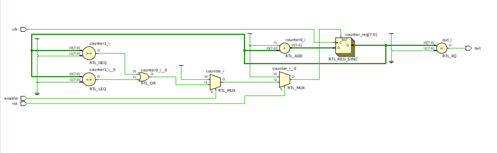

## Lab X report

**PB2111695 蔡孟辛**


### 1 实验目的与内容

> 1. 学习 Verilog 语言的进阶语法知识
> 2. 学习仿真文件的编写
> 3. 学习使用 Vivado 进行仿真 

### 2 逻辑设计

#### 2.1 if 语句与锁存器（1 分）

添加else补全if语句的逻辑关系，防止形成锁存器

```v
module top_module (
    input                       cpu_overheated,
    output  reg                 shut_off_computer,
    input                       arrived,
    input                       gas_tank_empty,
    output  reg                 keep_driving
);
    always @(*) begin
        if (cpu_overheated)
            shut_off_computer = 1'b1;
        else
            shut_off_computer = 1'b0;
    end
    always @(*) begin
        if (~arrived)
            keep_driving = ~gas_tank_empty;
        else
            keep_driving = 1'b0;
    end
endmodule
```

#### 2.2 case 语句与锁存器（1 分）

```v
module top_module (
    input       [15:0]                  scancode,
    output reg                          left,
    output reg                          down,
    output reg                          right,
    output reg                          up
); 
// Write your codes here.
always @(*) begin
    //在 case 语句之前为输出分配一个『默认值』
    up = 1'b0; down = 1'b0; left = 1'b0; right = 1'b0; 

    case (scancode)
        16'he06b: left <= 1'b1;
        16'he072: down <= 1'b1;
        16'he074: right <= 1'b1;
        16'he075: up <= 1'b1;
    endcase

end
endmodule
```

#### 2.3 生成波形（2 分）
```v
`timescale 1ns / 1ps
module q3_tb();
reg            clk;
reg            a;
reg            b;
reg     [3:0]       c;

initial clk=1'b1;
always #5 clk=~clk;

initial begin
    a=0;    b=0;    c=4'd0;
    #10;
    a=1'b1; b=1'b0; c=4'd1;
    #10;
    b=1'b1;
    #5;
    b=1'b0;
    #5;
    c=4'd2;
    #10;
    a=1'b0; b=1'b1;
    #10;
    a=1'b1; c=4'd3;
    #20;
    a=1'b0; b=1'b0;
    #5;
    b=1'b1;
    #5;
    a=1'b1; c=4'd4;
    #10;
    b=1'b0;
end
endmodule
```

#### 2.4 计数器 Pro（3 分）

```v
module Counter #(
    parameter   MAX_VALUE = 8'd100,
    parameter   MIN_VALUE = 8'd001
)(
    input                   clk,
    input                   rst,
    input                   enable,
    output                  out
);

reg [7:0] counter; //计数器

always @(posedge clk) begin
    //rst 信号的优先级高于 enable 信号
    if (rst==1'b1) 
        counter <=0;
    else begin
        //enable信号
        if(enable==1'b0) 
            counter <= 0;
        else begin
            if ((counter >= MAX_VALUE)||(counter < MIN_VALUE))
                counter <= MIN_VALUE;
            else
                counter <= counter + 8'd1;    
        end
    end
end

assign out = (counter == MAX_VALUE);
endmodule
```


### 3 仿真结果与分析

#### 3.1 题目3： 波形图
<div align=center>
</img>
</div>

#### 3.2 题目4：计数器 Pro
RTL电路截图：
<div align=center>
</img>
</div>

仿真结果：
<div align=center>
</img>
</div>

#### 3.3 附加题2：指出下面 RTL 电路中的五个元件分别对应了代码中的哪些部分
<div align=center>
</img>
</div>


### 4 总结

> 1. 学习到 Verilog 语言的进阶语法知识
> 2. 学习了仿真文件的编写
> 3. 学会了使用 Vivado 进行仿真 