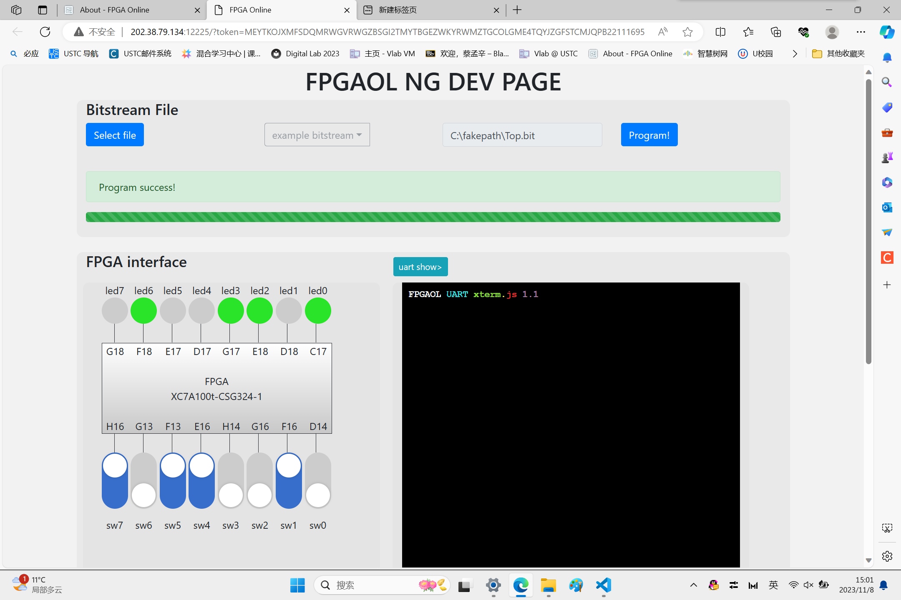
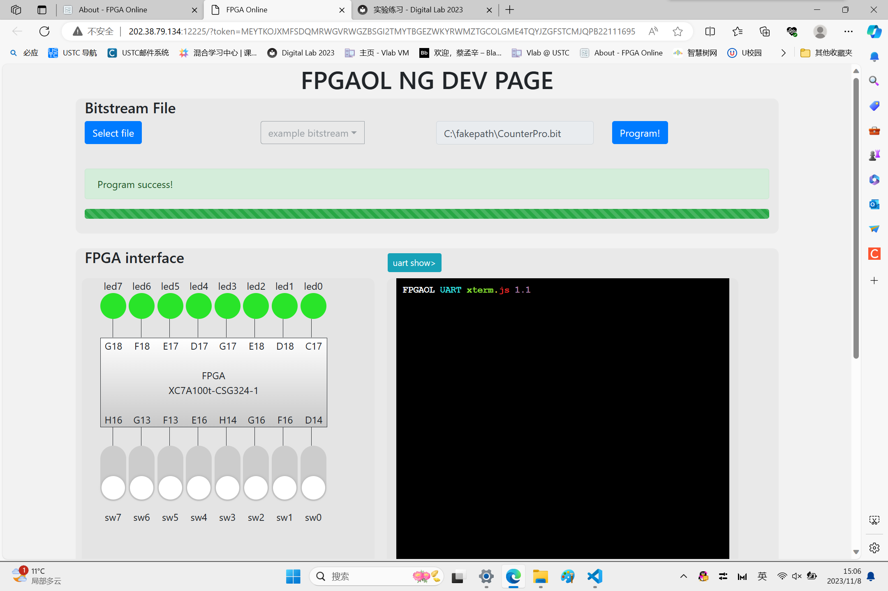
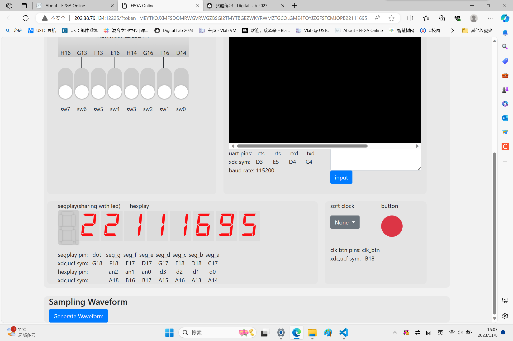
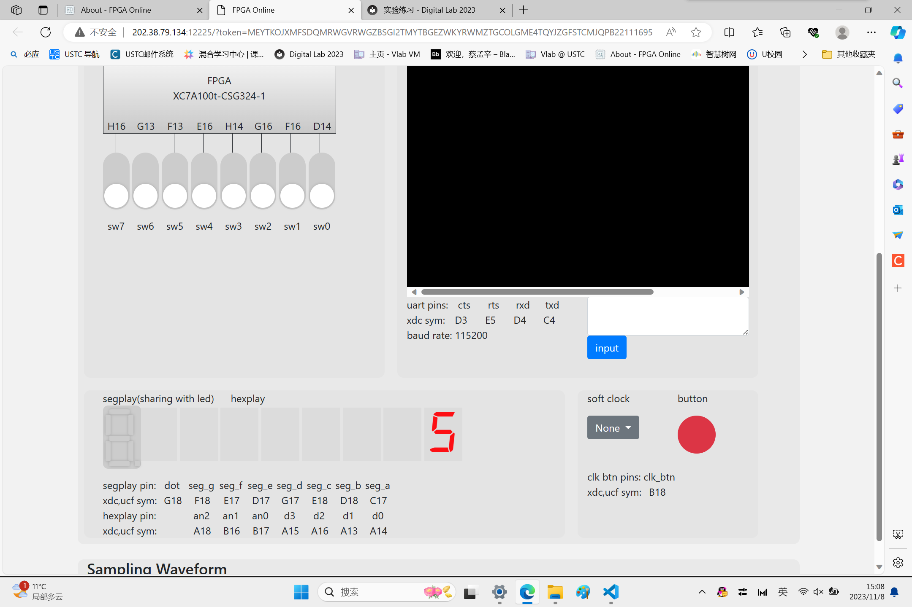
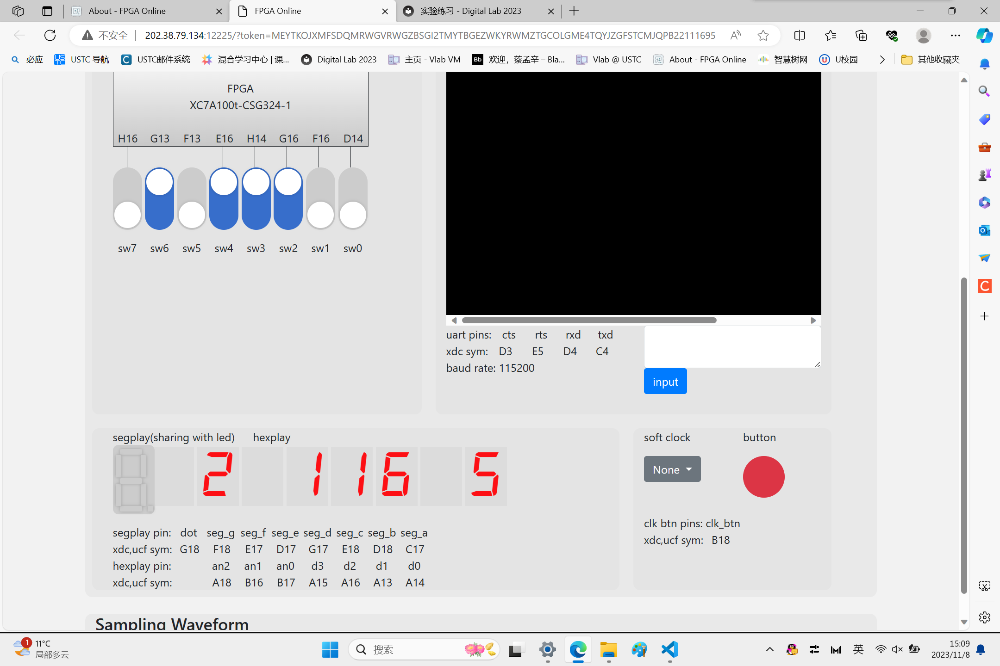

# Lab 3 report

**PB2111695 蔡孟辛**


## 1 实验目的与内容

> 1. 了解 FPGAOL 平台的使用方式
> 2. 学习使用 Vivado 开发项目并在 FPGAOL 上运行的流程
> 3. 学习基础的信号处理技术
> 4. 了解常见的 Vivado 警告信息

## 2 逻辑设计

### 2.1 开关与 LED

```v
module Top (
    input   [7:0]                       sw,
    output  [7:0]                       led
);
assign led = {sw[0],sw[1],sw[2],sw[3],sw[4],sw[5],sw[6],sw[7]};
endmodule
```

### 2.2 计数器 Pro Plus
```v
module CounterPro #(
    parameter   MAX_VALUE = 32'd50_000_000
)(
    input                   clk,
    input                   btn,
    output reg [7:0]        led           
);

wire rst;
assign rst=btn;
```
```v
reg [31:0] counter;

always @(posedge clk) begin
    if (rst) begin
        counter <= 0;
        led=8'b1111_1111;
    end
    else begin
        if (counter >= MAX_VALUE) begin
            counter <= 0;
            led<=~led;
        end
        else
            counter <= counter + 32'd1;
    end
end

endmodule
```

### 2.3 七段数码管
#### Top.v
```v
module Top(
    input                   clk,
    input                   btn,
    output [2:0]            seg_an,
    output [3:0]            seg_data
);
Segment segment(
    .clk(clk),
    .rst(btn),
    .output_data(32'h22111695),     // <- 改为你学号中的 8 位数字
    .seg_data(seg_data),
    .seg_an(seg_an)
);
endmodule
```
#### Segment.v
```v
module Segment(
    input                       clk,
    input                       rst,
    input       [31:0]          output_data,

    output reg  [ 3:0]          seg_data,
    output reg  [ 2:0]          seg_an
);

//计数器
reg [31:0] counter;
parameter   MAX_VALUE = 32'd250_000;
always @(posedge clk) begin
    if (rst)
        counter <= 0;
    else begin
        if (counter >= MAX_VALUE)
            counter <= 0;
        else
            counter <= counter + 32'b1;
    end
end

//Update seg_id
reg [2:0] seg_id;
initial 
    seg_id<=3'b000;

always @(posedge clk) begin
    if(counter==0) begin
        if(seg_id==3'b111)
            seg_id<=3'b000;
        else
            seg_id<=seg_id+1;
    end
```
```v
    else 
        seg_id<=seg_id;
end

// Update seg_data according to seg_id. Hint: Use "case".
wire [31:0] output_data;
always @(*) begin
    seg_data = 0;
    seg_an = seg_id;    // <- Same for all cases
    case(seg_an) 
        3'b000: seg_data<=output_data[3:0];
        3'b001: seg_data<=output_data[7:4];
        3'b010: seg_data<=output_data[11:8];
        3'b011: seg_data<=output_data[15:12];
        3'b100: seg_data<=output_data[19:16];
        3'b101: seg_data<=output_data[23:20];
        3'b110: seg_data<=output_data[27:24];
        3'b111: seg_data<=output_data[31:28];
    endcase   
end

endmodule
```

### 2.4 带有掩码的数码管（选做第三题）

#### Top.v
```v
module Top(
    input                   clk,
    input                   btn,
    input  [7:0]            sw,

    output [2:0]            seg_an,
    output [3:0]            seg_data
);
```
```v
Segment segment(
    .clk(clk),
    .rst(btn),

    .output_data(32'h22111695),    
    .output_valid(sw),
    .seg_data(seg_data),
    .seg_an(seg_an)
);
endmodule
```
#### Segment.v
```v
module Segment(
    input                       clk,
    input                       rst,
    input       [31:0]          output_data,
    input       [ 7:0]          output_valid,

    output reg  [ 3:0]          seg_data,
    output reg  [ 2:0]          seg_an
);

//计数器
reg [31:0] counter;
parameter   MAX_VALUE = 32'd250_000;
always @(posedge clk) begin
    if (rst)
        counter <= 0;
    else begin
        if (counter >= MAX_VALUE)
            counter <= 0;
        else
            counter <= counter + 32'b1;
    end
end
```
```v
//Update seg_id
reg [2:0] seg_id;
initial 
    seg_id<=3'b000;

always @(posedge clk) begin
    if(counter==0) begin
        if(seg_id==3'b111)
            seg_id<=3'b000;
        else
            seg_id<=seg_id+1;
    end
    else 
        seg_id<=seg_id;
end

// Update seg_data according to seg_id. Hint: Use "case".
wire [31:0] output_data;
always @(*) begin
    seg_an = 0;    // <- Same for all cases
    seg_data = output_data[3:0];
    case(seg_id) 
        3'b000: seg_data<=output_data[3:0];
        3'b001: begin
            if(output_valid[1]) begin
                seg_data<=output_data[7:4];
                seg_an<=3'b001;
            end
        end
        3'b010: begin
            if(output_valid[2]) begin
                seg_data<=output_data[11:8];
                seg_an<=3'b010;
            end
        end
        3'b011: begin
            if(output_valid[3]) begin
                seg_data<=output_data[15:12];
                seg_an<=3'b011;
            end
        end
        3'b100: begin
            if(output_valid[4]) begin
                seg_data<=output_data[19:16];
                seg_an<=3'b100;
            end
        end
        3'b101: begin
            if(output_valid[5]) begin
                seg_data<=output_data[23:20];
                seg_an<=3'b101;
            end
        end
        3'b110: begin
            if(output_valid[6]) begin
                seg_data<=output_data[27:24];
                seg_an<=3'b110;
            end
        end
        3'b111: begin
            if(output_valid[7]) begin
                seg_data<=output_data[31:28];
                seg_an<=3'b111;
            end
        end
    endcase   
end

endmodule
```

## 3 测试结果与分析

### 3.1 开关与 LED

<div align=center>
</img>
</div>

### 3.2 计数器 Pro Plus

<div align=center>
</img>
</div>

### 3.3 七段数码管

<div align=center>
</img>
</div>

### 3.4 (选做)带有掩码的数码管

<div align=center>
</img>
</div>

<div align=center>
</img>
</div>


## 总结

>  学到很多，感谢老师和助教们