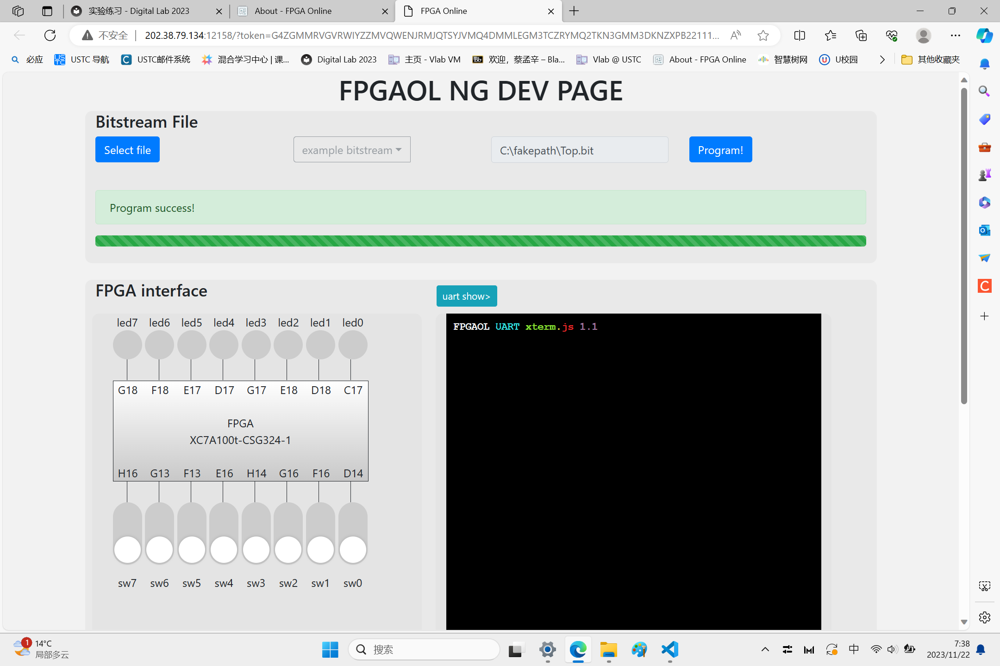
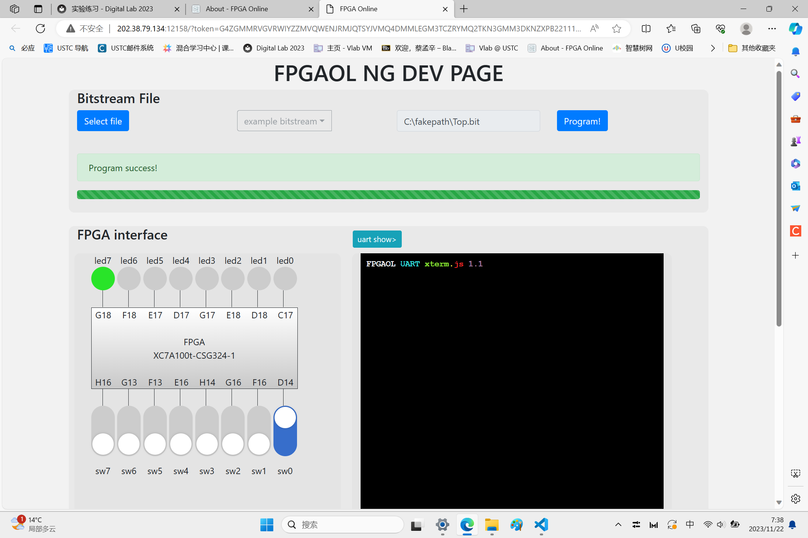
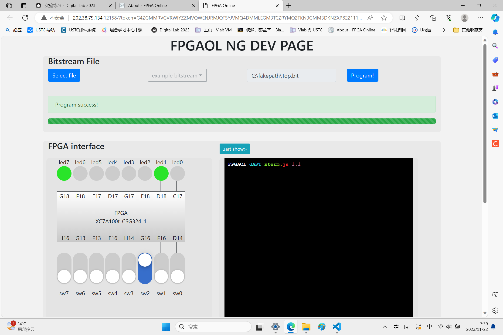
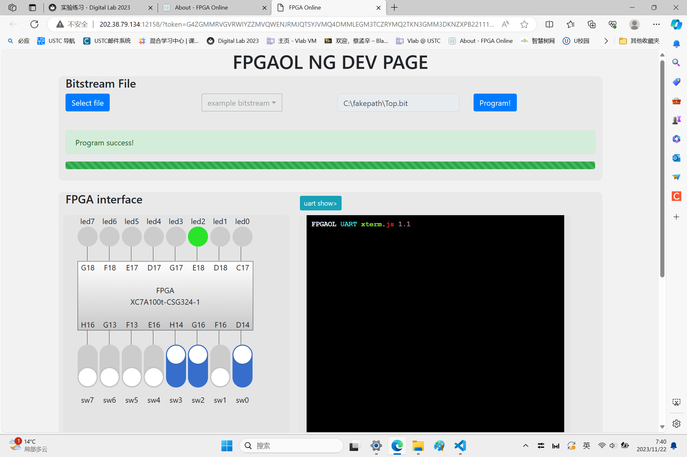
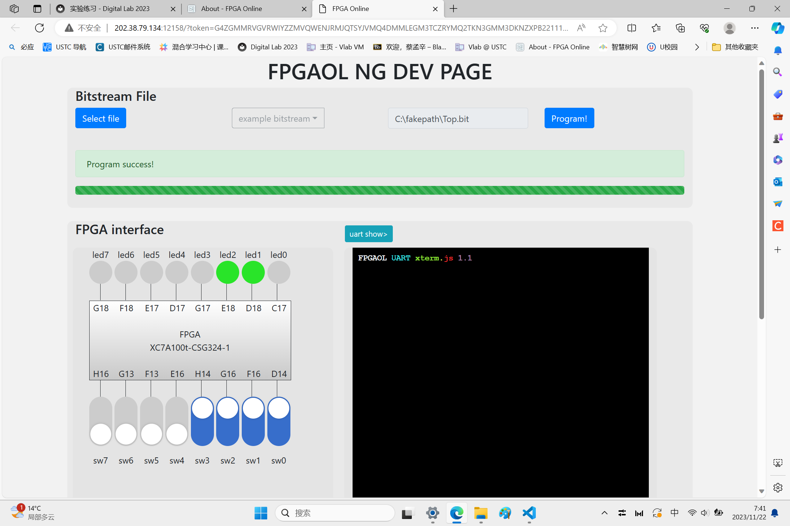
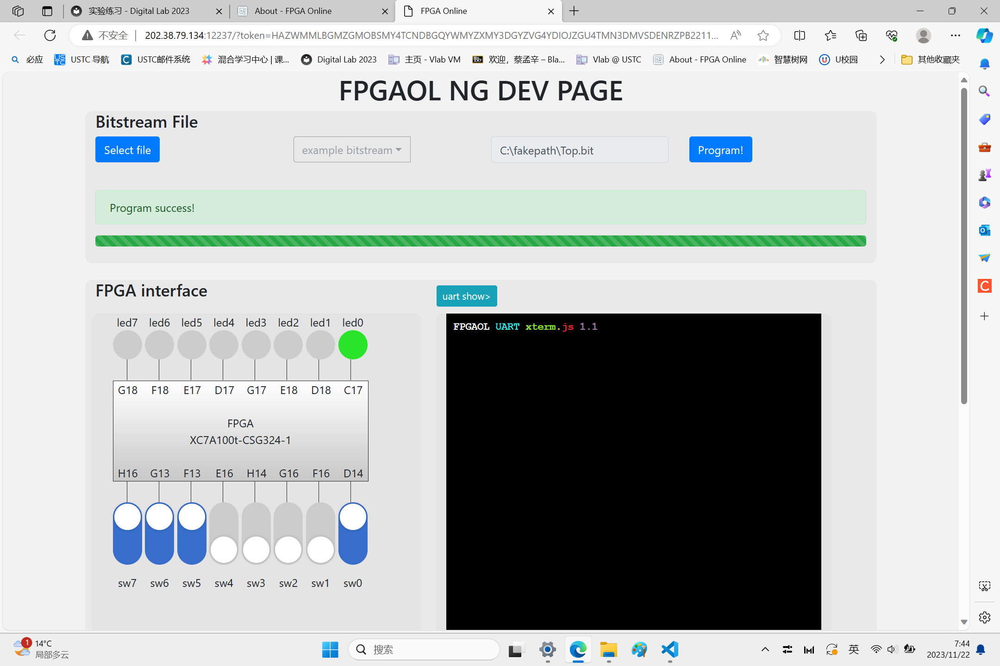
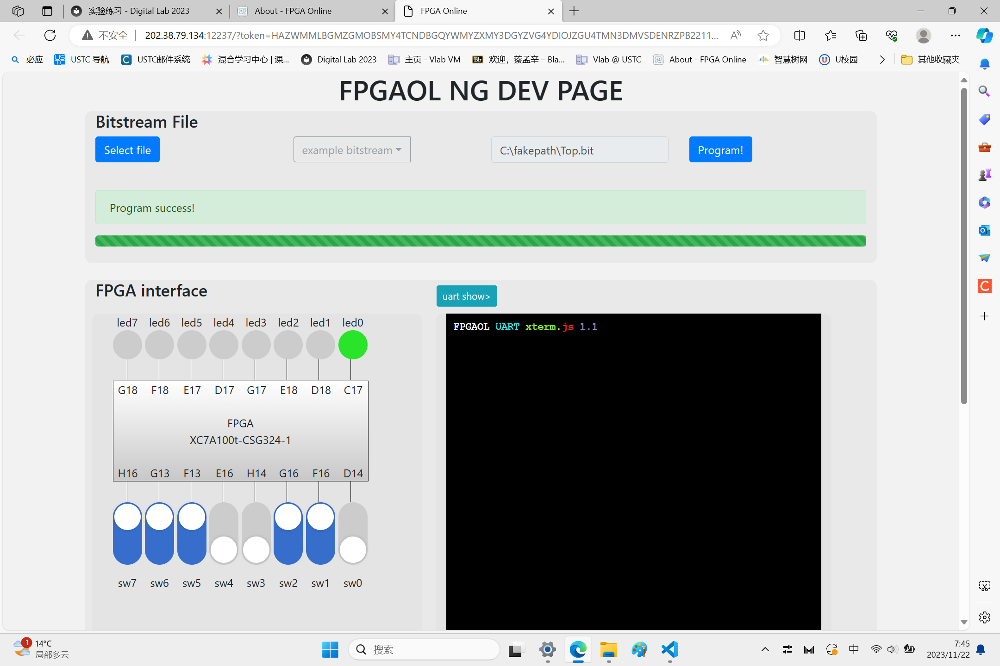

# Lab 4 report

**PB2111695 蔡孟辛**


## 1 实验目的与内容

### 1.1 实验目标
> 1. 通过进一步学习模块化的思想，能够将一些常见的组合逻辑电路用 Verilog 硬件描述语言实现
> 2. 学习组合逻辑电路分析的基本技巧
> 3. 学习组合逻辑电路设计的基本技巧

### 1.2 实验内容
> 1. 学习组合电路的设计流程
> 2. 学习组合逻辑电路设计的实例
> 3. 学习如何使用 Logisim 自动生成组合逻辑电路
> 4. 完成 Lab4 的实验练习题

## 2 逻辑设计

### 2.1 编码器 Pro
Top.v
```v
module Top(
    input  [3:0]            sw,
    output [7:0]            led
);
assign led[6:2]=5'b0;
```
```v
encode segment(
    .I(sw),
    .en(led[7]),
    .Y(led[1:0])
);
endmodule
``` 

encode.v
```v
module encode(
    input [3:0]         I,
    output reg [1:0]    Y,
    output reg          en
);
always @(*) begin
    if(I==4'b0000) 
        en <= 0;
    else begin
        en <= 1;
        case(I)
            4'b1000: Y = 2'b11;
            4'b0100: Y = 2'b10;
            4'b0010: Y = 2'b01;
            4'b0001: Y = 2'b00;
            default: Y = 2'b00;
        endcase
    end
end
endmodule
```

### 2.2 2bits 半加器
Top.v
```v
module Top(
    input  [3:0]            sw,
    output [7:0]            led
);
assign led[7:3]=5'b0;
adder2bit segment(
    .a(sw[3:2]),
    .b(sw[1:0]),
    .out(led[1:0]),
    .Cout(led[2])
);
endmodule
```
adder2bit.v
```v
module adder2bit(
    input           [1:0]         a,
    input           [1:0]         b,
    output          [1:0]         out,
    output                        Cout
);
wire temp;
HalfAdder dw(
    .a(a[0]),
    .b(b[0]),
    .s(out[0]),
    .c(temp)
);
FullAdder gw(
    .a(a[1]),
    .b(b[1]),
    .cin(temp),
    .s(out[1]),
    .cout(Cout)
);
endmodule
```
FullAdder.v
```v
module FullAdder (
    input       a, b, cin,
    output      s, cout
);
wire temp_s, temp_c_1, temp_c_2;
HalfAdder ha1(
    .a(a),
    .b(b),
    .s(temp_s),
    .c(temp_c_1)
);

HalfAdder ha2(
    .a(temp_s),
    .b(cin),
    .s(s),
    .c(temp_c_2)
);
HalfAdder ha3(
    .a(temp_c_1),
    .b(temp_c_2),
    .s(cout),
    .c()
);
endmodule
```
HalfAdder.v
```v
module HalfAdder(
    input           a, b, 
    output          s, c
);
    assign s = a ^ b;
    assign c = a & b;
endmodule
```

### 2.3 8bits 5 的倍数检测器
Top.v
```v
module Top(
    input  [7:0]            sw,
    output [7:0]            led
);
assign led[7:1]=7'b0;
multiple5 segment(
    .num(sw[7:0]),
    .ismultiple5(led[0])
);
endmodule
```
multiple5.v
```v
module multiple5(
    input           [7:0]          num,
    output   reg                   ismultiple5
);
wire [2:0] sum_odd,sum_even;

adder2bit odd(
    .a(num[1:0]),
    .b(num[5:4]),
    .out(sum_odd[1:0]),
    .Cout(sum_odd[2])
);
adder2bit even(
    .a(num[3:2]),
    .b(num[7:6]),
    .out(sum_even[1:0]),
    .Cout(sum_even[2])
);
```
```v
always @(*) begin
    if(sum_odd[2]==sum_even[2]) begin
        if(sum_odd[1]==sum_even[1]&&sum_odd[0]==sum_even[0])
            ismultiple5<=1;
        else
            ismultiple5<=0;
            
    end
    else begin
        case(sum_odd)
            3'b110: 
                if(sum_even==3'b001)
                    ismultiple5<=1;
                else ismultiple5<=0;
            3'b101: 
                if(sum_even==3'b000)
                    ismultiple5<=1;
                else ismultiple5<=0;
            3'b001: 
                if(sum_even==3'b110)
                    ismultiple5<=1;
                else ismultiple5<=0;
            3'b000: 
                if(sum_even==3'b101)
                    ismultiple5<=1;
                else ismultiple5<=0;
            default: ismultiple5<=0;
        endcase
    end
end
endmodule
```

## 3 测试结果与分析

### 3.1 编码器 Pro

<div align=center>
</img>
</div>

<div align=center>
</img>
</div>

<div align=center>
</img>
</div>

<div align=center>
</img>
</div>

<div align=center>
</img>
</div>

### 3.2 2bits 半加器

<div align=center>
</img>
</div>

<div align=center>
</img>
</div>

### 3.3 8bits 5 的倍数检测器

<div align=center>
</img>
</div>

<div align=center>
</img>
</div>

## 总结

> 1. 系统学习了组合逻辑电路的相关知识，掌握组合电路设计的相关技巧，获益良多