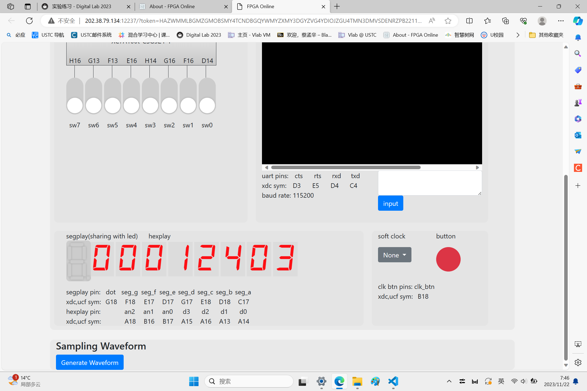
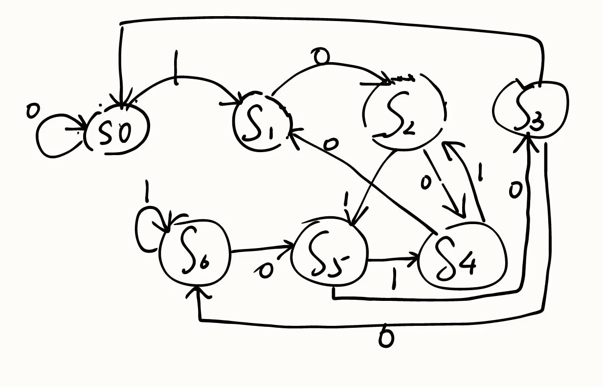
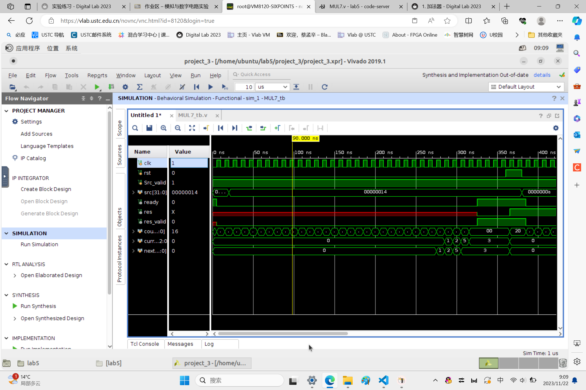

## Lab 5 report

**PB2111695 蔡孟辛**

### 实验目的与内容

> 1. 学习并掌握有限状态机的设计方法；
> 2. 学习并掌握利用有限状态机编写 Verilog 程序实现时序逻辑电路的方法。

### 题目 1：寄存器堆
#### 1.1 逻辑设计
```v
module Regfile (
    input                       clk,          // 时钟信号
    input           [4:0]       ra1,          // 读端口 1 地址
    input           [4:0]       ra2,          // 读端口 2 地址
    input           [4:0]       wa,           // 写端口地址
    input                       we,           // 写使能信号
    input           [31:0]      din,          // 写数据
    output  reg     [31:0]      dout1,        // 读端口 1 数据输出
    output  reg     [31:0]      dout2         // 读端口 2 数据输出
);
// 寄存器堆的规模为 32x32bits
reg [31:0] reg_file [31:0];

// 0 号寄存器始终保持 0
always @(*) begin
    reg_file[0]=32'b0;
end

// 读端口 1
always @(*) begin
    if(we&&(wa==ra1)&&(wa!=0))
        dout1=din;
    else
        dout1 = reg_file[ra1];
end
```
```v
// 读端口 2
always @(*) begin
    if(we&&(wa==ra2)&&(wa!=0))
        dout2=din;
    else
        dout2 = reg_file[ra2];
end
    
// 写端口
always @(posedge clk) begin
    if (we) begin
        if(wa)
            reg_file[wa] <= din;
    end
end

endmodule
```

#### 1.2 仿真结果与分析
仿真测试文件：
```v
module RegFile_tb ();
reg     [ 0 : 0] clk;
reg     [ 4 : 0] ra1, ra2, wa;
reg     [ 0 : 0] we;
reg     [31 : 0] din;
wire    [31 : 0] dout1;
wire    [31 : 0] dout2;
```
```v
RegFile regfile(
    .clk(clk),
    .ra1(ra1),
    .ra2(ra2),
    .wa(wa),
    .we(we),
    .din(din),
    .dout1(dout1),
    .dout2(dout2)
);

initial begin
    clk = 0;
    ra1 = 5'H0; ra2 = 5'H0; wa = 5'H0; we = 1'H0; din = 32'H0;

    #12
    ra1 = 5'H0; ra2 = 5'H0; wa = 5'H3; we = 1'H1; din = 32'H12345678;

    #5
    ra1 = 5'H0; ra2 = 5'H0; wa = 5'H0; we = 1'H0; din = 32'H0;

    #5
    ra1 = 5'H3; ra2 = 5'H2; wa = 5'H2; we = 1'H1; din = 32'H87654321;

    #5
    ra1 = 5'H0; ra2 = 5'H0; wa = 5'H0; we = 1'H0; din = 32'H0;

    #5
    ra1 = 5'H3; ra2 = 5'H0; wa = 5'H0; we = 1'H1; din = 32'H87654321;

    #10
    $finish;
end
always #5 clk = ~clk;
endmodule
```
仿真文件的运行结果截图：
<div align=center>
</img>
</div>

### 题目 2：数码管时钟
#### 2.1 逻辑设计
```v
module TIMER (
    input                           clk, rst,
    output           [3:0]       out,
    output           [2:0]       select
);

reg [3:0] outh;
reg [3:0] outms;
reg [3:0] outmg;
reg [3:0] outss;
reg [3:0] outsg;
reg [39:0] count;
```
```v
initial begin
    outh    = 4'h1;
    outms   = 4'h2;
    outmg   = 4'h3;
    outss   = 4'h4;
    outsg   = 4'h5;
    count   = 40'h0;
end

always @(posedge clk) begin
    if(rst) begin
        count<=40'h1;
    end
    else begin
        if (count != 40'd100_000_000) //1s
            count <= count +40'h1;
        else
            count <=40'h1;
    end
end

/*使用 Lab3 实验练习中编写的数码管显示模块*/
Segment segment(
    .clk                (clk),
    .rst                (rst),
    .output_data        ({12'b0, outh, outms, outmg, outss,outsg}),
    .output_valid       (8'HFF),     
    .seg_data           (out),
    .seg_an             (select)
);

always@ (posedge clk) begin
    if(rst) begin
        outh    <=  4'H1;
        outms   <=  4'H2;
        outmg   <=  4'H3;
        outss   <=  4'H4;
        outsg   <=  4'H5;
    end
    else begin
        if(count == 40'd100_000_000) begin
            if(outsg != 4'h9)
                outsg <= outsg+1;
            else begin
                outsg <= 4'h0;
                if(outss != 4'h5)
                    outss <= outss + 1;
                else begin
                    outss <= 4'h0;
                    if(outmg != 4'h9)
                        outmg <= outmg + 1;
                    else begin
                        outmg <= 4'h0;
                        if(outms != 4'h5)
                            outms <= outms +1;
                        else begin
                            outms <= 4'b0;
                            if(outh != 4'h9)
                                outh <=outh+1;
                            else
                                outh <=0;
                        end
                    end
                end
            end
        end
    end
end

endmodule
```

#### 2.2 测试结果与分析
实验上板结果截屏:
<div align=center>
</img>
</div>

### 题目 1：倍数检测器——再临
#### 3.1 代码部分
```v
module MUL7(
    input                               clk,            // 时钟信号
    input                               rst,            // 复位信号，使状态机回到初始态
    input               [31 : 0]        src,            // 输入数据
    input                               src_valid,      // 表明输入结果是否有效
    output      reg                     ready,          // 表明是否正在检测
    output      reg                     res,            // 输出结果
    output      reg                     res_valid       // 表明输出结果是否有效
);
reg [5:0] count;
initial begin
    count =6'b100000;
    ready =1;
end 
reg [31:0] srcin;
```
```v
// 状态空间位数 n
parameter WIDTH = 3;
// 状态变量
reg [WIDTH-1: 0] current_state, next_state;
initial begin
    current_state<=0;
    next_state<=0;
end

// 为了便于标识，我们用局部参数定义状态的别名代替状态编码
localparam STATE_NAME_0 = 3'd0;
localparam STATE_NAME_1 = 3'd1;
localparam STATE_NAME_2 = 3'd2;
localparam STATE_NAME_3 = 3'd3;
localparam STATE_NAME_4 = 3'd4;
localparam STATE_NAME_5 = 3'd5;
localparam STATE_NAME_6 = 3'd6;

//新输入
always @(posedge clk) begin
    if(!rst && src_valid && ready == 1) begin
        srcin <= src;
        count <= 6'b100000;
        ready <= 0;
        res_valid <= 0;
    end
end

// ==========================================================
// Part 1: 使用同步时序进行状态更新，即更新 current_state 的内容。
// ==========================================================
always @(posedge clk) begin
    // 首先检测复位信号
    if (rst)  begin
        current_state <= 0;
        count <= 6'b100000;
    end
    // 随后再进行内容更新
    else begin
        current_state <= next_state;
        if(count!=6'd0) begin
            count<= count -1;
        end
        else begin
            count<= 6'd0;
            ready<=1;
            res_valid<=1;
        end
    end
end

// ==========================================================
// Part 2: 使用组合逻辑判断状态跳转逻辑，即根据 current_state 与
//         其他信号确定 next_state。
// ==========================================================
// 一般使用 case + if 语句描述跳转逻辑
always @(*) begin
    // 先对 next_state 进行默认赋值，防止出现遗漏
    next_state = current_state;
    if(src_valid)begin
        if(count!=0) begin
            case (current_state)
                STATE_NAME_0: begin
                    if(srcin[count])
                        next_state <= STATE_NAME_1;
                    else
                        next_state <= STATE_NAME_0;
                end
                STATE_NAME_1: begin
                    if(srcin[count])
                        next_state <= STATE_NAME_3;
                    else
                        next_state <= STATE_NAME_2;
                end
                    STATE_NAME_2: begin
                    if(srcin[count])
                        next_state <= STATE_NAME_5;
                    else
                        next_state <= STATE_NAME_4;
                end
                STATE_NAME_3: begin
                    if(srcin[count])
                        next_state <= STATE_NAME_0;
                    else
                        next_state <= STATE_NAME_6;
                end
                STATE_NAME_4: begin
                    if(srcin[count])
                        next_state <= STATE_NAME_2;
                    else
                        next_state <= STATE_NAME_1;
                end
                STATE_NAME_5: begin
                    if(srcin[count])
                        next_state <= STATE_NAME_4;
                    else
                        next_state <= STATE_NAME_3;
                end
                STATE_NAME_6: begin
                    if(srcin[count])
                        next_state <= STATE_NAME_6;
                    else
                        next_state <= STATE_NAME_5;
                end
            endcase
        end
    end
end

// ==========================================================
// Part 3: 使用组合逻辑描述状态机的输出。这里是 mealy 型状态机
//         与 moore 型状态机区别的地方。
// ==========================================================
// 可以直接使用 assign 进行简单逻辑的赋值
//assign out1 = ......;
// 也可以用 case + if 语句进行复杂逻辑的描述
always @(*) begin
    if(ready==1 && res_valid==1)
        case (current_state)
            STATE_NAME_0: begin
                res<=1;
            end
            default: begin
                res<=0;
            end
        endcase
end
endmodule
```
#### 3.2 状态机的状态转换图
<div align=center>
</img>
</div>

#### 3.3 仿真结果与分析
仿真测试文件：
```v
module MUL7_tb();
reg clk, rst,src_vaild;
reg [31:0] src;
wire ready,res,res_valid;

initial begin
    clk = 0; 
end
always #5 clk = ~clk;

initial begin
    rst = 0;
    src_vaild = 1;
    #20;
    src = 32'd21; 
    #20;
    src = 32'd22;
    #330;
    src = 32'd14;
    #20;
    rst=1;
end


MUL7 tb (
    .clk(clk),
    .rst(rst),
    .src(src),
    .src_vaild(src_vaild),
    .ready(ready),
    .res(res),
    .res_valid(res_valid)
);
endmodule
```

仿真文件的运行结果截图：
<div align=center>
</img>
</div>


### 总结

> 1. 学习时序逻辑电路设计，获益良多