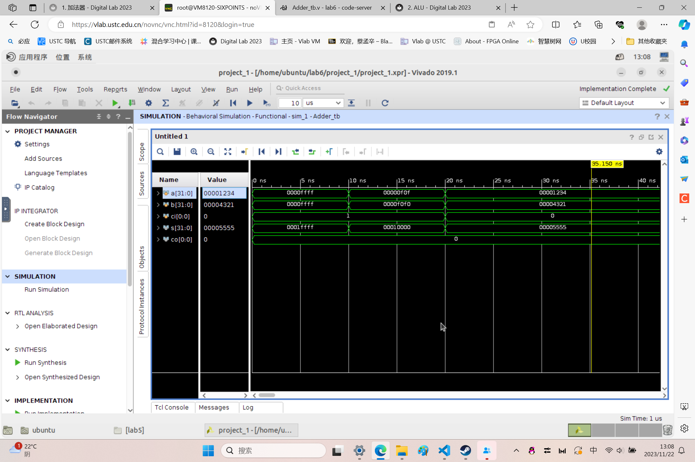
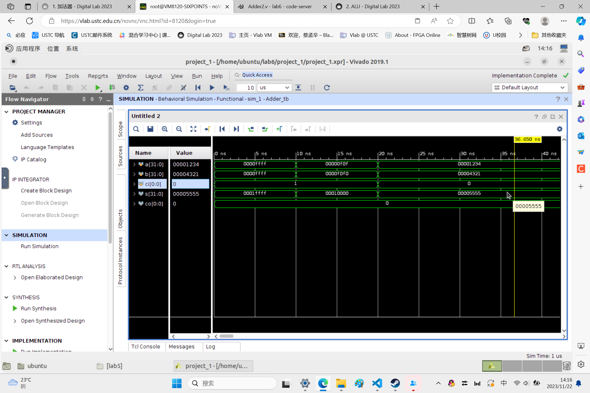
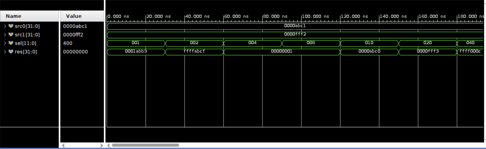
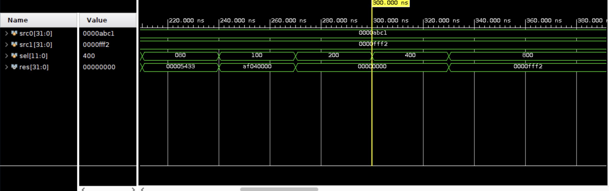
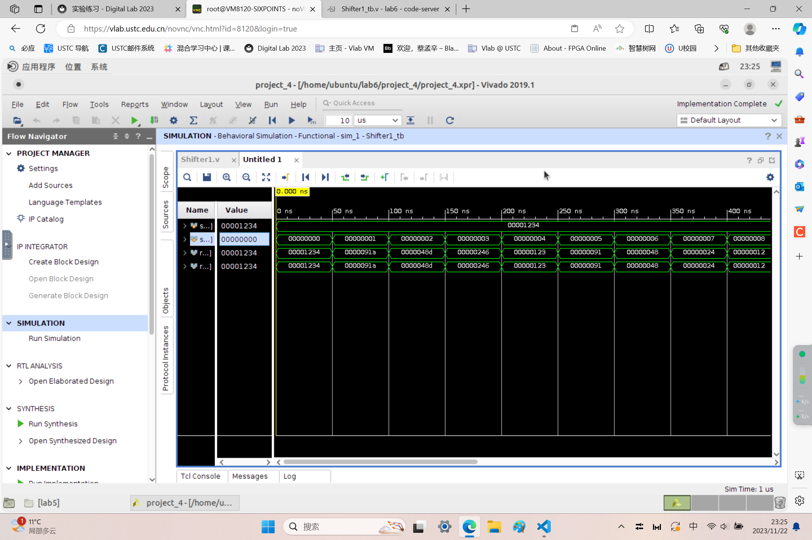
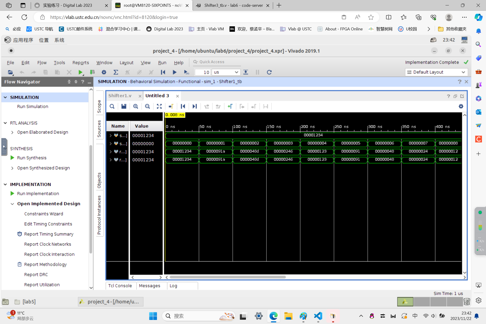

## Lab 6 report

**PB2111695 蔡孟辛**


### 实验目的与内容

> 1. 设计 4 位超前进位加法器，并将其层次扩展到 32 位。
> 2. 以超前进位加法器为基础，设计与实现 ALU.

## 必做内容

### 题目 1：加法器

#### 1.1 逻辑设计

###### 4位超前进位加法器：
```v
module Adder_LookAhead4 (
    input                   [ 3 : 0]            a, b,
    input                   [ 0 : 0]            ci,         // 来自低位的进位
    output                  [ 3 : 0]            s,          // 和
    output                  [ 0 : 0]            co          // 向高位的进位
);

wire    [3:0] C;
wire    [3:0] G;
wire    [3:0] P;

assign  G = a & b;
assign  P = a ^ b;

assign  C[0] = G[0] | ( P[0] & ci );
assign  C[1] = G[1] | ( P[1] & G[0] ) | ( P[1] & P[0] & ci );
assign  C[2] = G[2] | ( P[2] & G[1] ) | ( P[2] & P[1] & G[0] ) | ( P[2] & P[1] & P[0] & ci );
assign  C[3] = G[3] | ( P[3] & G[2] ) | ( P[3] & P[2] & G[1] ) | ( P[3] & P[2] & P[1] & G[0] ) | ( P[3] & P[2] & P[1] & P[0] & ci );
```
```v
// TODO：确定 s 和 co 的产生逻辑
assign  s[0] = P[0] ^ ci;
assign  s[1] = P[1] ^ C[0];
assign  s[2] = P[2] ^ C[1];
assign  s[3] = P[3] ^ C[2];
assign  co   = C[3];

endmodule
```

###### 4 位超前进位加法器 + 层次扩展成 32 位：
```v
module Adder (
    input                   [31 : 0]        a, b,
    input                   [ 0 : 0]        ci,
    output                  [31 : 0]        s,
    output                  [ 0 : 0]        co
);
wire    [6:0] cmid;
Adder_LookAhead4 adder0(
    .a(a[3:0]),
    .b(b[3:0]),
    .ci(ci),
    .s(s[3:0]),
    .co(cmid[0])
);

Adder_LookAhead4 adder1(
    .a(a[7:4]),
    .b(b[7:4]),
    .ci(cmid[0]),
    .s(s[7:4]),
    .co(cmid[1])
);
```
```v
Adder_LookAhead4 adder2(
    .a(a[11:8]),
    .b(b[11:8]),
    .ci(cmid[1]),
    .s(s[11:8]),
    .co(cmid[2])
);

Adder_LookAhead4 adder3(
    .a(a[15:12]),
    .b(b[15:12]),
    .ci(cmid[2]),
    .s(s[15:12]),
    .co(cmid[3])
);

Adder_LookAhead4 adder4(
    .a(a[19:16]),
    .b(b[19:16]),
    .ci(cmid[3]),
    .s(s[19:16]),
    .co(cmid[4])
);

Adder_LookAhead4 adder5(
    .a(a[23:20]),
    .b(b[23:20]),
    .ci(cmid[4]),
    .s(s[23:20]),
    .co(cmid[5])
);

Adder_LookAhead4 adder6(
    .a(a[27:24]),
    .b(b[27:24]),
    .ci(cmid[5]),
    .s(s[27:24]),
    .co(cmid[6])
);

Adder_LookAhead4 adder7(
    .a(a[31:28]),
    .b(b[31:28]),
    .ci(cmid[6]),
    .s(s[31:28]),
    .co(co)
);

endmodule
```

###### 8 位超前进位加法器：
```v
module Adder_LookAhead8 (
    input                   [ 7 : 0]            a, b,
    input                   [ 0 : 0]            ci,         // 来自低位的进位
    output                  [ 7 : 0]            s,          // 和
    output                  [ 0 : 0]            co          // 向高位的进位
);

wire    [7:0] C;
wire    [7:0] G;
wire    [7:0] P;

assign  G = a & b;
assign  P = a ^ b;

assign  C[0] = G[0] | ( P[0] & ci );
assign  C[1] = G[1] | ( P[1] & G[0] ) | ( P[1] & P[0] & ci );
assign  C[2] = G[2] | ( P[2] & G[1] ) | ( P[2] & P[1] & G[0] ) | ( P[2] & P[1] & P[0] & ci );
assign  C[3] = G[3] | ( P[3] & G[2] ) | ( P[3] & P[2] & G[1] ) | ( P[3] & P[2] & P[1] & G[0] ) | ( P[3] & P[2] & P[1] & P[0] & ci );
assign  C[4] = G[4] | ( P[4] & G[3] ) | ( P[4] & P[3] & G[2] ) | ( P[4] & P[3] & P[2] & G[1] ) | ( P[4] & P[3] & P[2] & P[1] & G[0] ) | ( P[4] & P[3] & P[2] & P[1] & P[0] & ci );
assign  C[5] = G[5] | ( P[5] & G[4] ) | ( P[5] & P[4] & G[3] ) | ( P[5] & P[4] & P[3] & G[2] ) | ( P[5] & P[4] & P[3] & P[2] & G[1] ) | ( P[5] & P[4] & P[3] & P[2] & P[1] & G[0] ) | ( P[5] & P[4] & P[3] & P[2] & P[1] & P[0] & ci );
assign  C[6] = G[6] | ( P[6] & G[5] ) | ( P[6] & P[5] & G[4] ) | ( P[6] & P[5] & P[4] & G[3] ) | ( P[6] & P[5] & P[4] & P[3] & G[2] ) | ( P[6] & P[5] & P[4] & P[3] & P[2] & G[1] ) | ( P[6] & P[5] & P[4] & P[3] & P[2] & P[1] & G[0] ) | ( P[6] & P[5] & P[4] & P[3] & P[2] & P[1] & P[0] & ci );
assign  C[7] = G[7] | ( P[7] & G[6] ) | ( P[7] & P[6] & G[5] ) | ( P[7] & P[6] & P[5] & G[4] ) | ( P[7] & P[6] & P[5] & P[4] & G[3] ) | ( P[7] & P[6] & P[5] & P[4] & P[3] & G[2] ) | ( P[7] & P[6] & P[5] & P[4] & P[3] & P[2] & G[1] ) | ( P[7] & P[6] & P[5] & P[4] & P[3] & P[2] & P[1] & G[0] ) | ( P[7] & P[6] & P[5] & P[4] & P[3] & P[2] & P[1] & P[0] & ci );

```
```v
assign  s[0] = P[0] ^ ci;
assign  s[1] = P[1] ^ C[0];
assign  s[2] = P[2] ^ C[1];
assign  s[3] = P[3] ^ C[2];
assign  s[4] = P[4] ^ C[4];
assign  s[5] = P[5] ^ C[5];
assign  s[6] = P[6] ^ C[6];
assign  s[7] = P[7] ^ C[7];
assign  co   = C[7];

endmodule
```

###### 8 位超前进位加法器 + 层次扩展成 32 位：
```v
module Adder2 (
    input                   [31 : 0]        a, b,
    input                   [ 0 : 0]        ci,
    output                  [31 : 0]        s,
    output                  [ 0 : 0]        co
);
wire    [2:0] cmid;
Adder_LookAhead8 adder0(
    .a(a[7:0]),
    .b(b[7:0]),
    .ci(ci),
    .s(s[7:0]),
    .co(cmid[0])
);

Adder_LookAhead8 adder1(
    .a(a[15:8]),
    .b(b[15:8]),
    .ci(cmid[0]),
    .s(s[15:8]),
    .co(cmid[1])
);
```
```v
Adder_LookAhead8 adder2(
    .a(a[23:16]),
    .b(b[23:16]),
    .ci(cmid[1]),
    .s(s[23:16]),
    .co(cmid[2])
);

Adder_LookAhead8 adder3(
    .a(a[31:24]),
    .b(b[31:24]),
    .ci(cmid[2]),
    .s(s[31:24]),
    .co(c0)
);

endmodule
```

#### 1.2 仿真结果与分析
###### 仿真文件：
```v
module Adder_tb();
reg     [31:0] a,b;
reg     [ 0:0] ci;
wire    [31:0] s;
wire    [ 0:0] co;  


initial begin
    a=32'hffff; b=32'hffff; ci=1'b1;
    #10;
    a=32'h0f0f; b=32'hf0f0; ci=1'b1;
    #10;
    a=32'h1234; b=32'h4321; ci=1'b0;
end
```
```v
Adder adder(
    .a(a),
    .b(b),
    .ci(ci),
    .s(s),
    .co(co)
);

endmodule
```
###### 4 to 32 仿真文件的运行结果截图：
<div align=center>
</img>
</div>

###### 8 to 32 仿真文件的运行结果截图：
<div align=center>
</img>
</div>

### 题目 2：ALU

#### 2.1 逻辑设计

###### 完整的 32 位 ALU：
```v
module ALU(
    input                   [31 : 0]        src0, src1,
    input                   [11 : 0]        sel,
    output                  [31 : 0]        res
);

wire [31:0] adder_out;
wire [31:0] sub_out;
wire [0 :0] slt_out;
wire [0 :0] sltu_out;
```
```v
Adder adder(
    .a(src0),
    .b(src1),
    .ci(1'B0),
    .s(adder_out),
    .co()
);

AddSub sub(
    .a(src0),
    .b(src1),
    .out(sub_out),
    .co()
);

Comp comp(
    .a(src0),
    .b(src1),
    .ul(sltu_out),
    .sl(slt_out)
);

// TODO：完成 res 信号的选择
always @(*) begin
    case(sel)
        12'h001:    res = adder_out;
        12'h002:    res = sub_out;
        12'h004:    res = slt_out;
        12'h008:    res = sltu_out;
        12'h010:    res = src0 & src1;
        12'h020:    res = src0 | src1;
        12'h040:    res = ~(src0 | src1);
        12'h080:    res = src0 ^ src1;
        12'h100:    res = src0 << src1[4:0];
        12'h200:    res = src0 >> src1[4:0];
        12'h400:    res = src0 >>> src1[4:0];
        12'h800:    res = src1;
    endcase
end

endmodule
```

###### 减法运算：
```v
module AddSub (
    input                   [ 31 : 0]        a, b,
    output                  [ 31 : 0]        out,
    output                  [ 0  : 0]        co
);

Adder fa1(
    .a(a),
    .b(~b),
    .ci(1'B1),
    .s(out),
    .co(co)
);

endmodule
```

###### 有符号比较 & 无符号比较：
```v
module Comp(
    input   [31:0]  a,b,
    output  [0:0]  ul,sl
);

wire [31:0] s;
wire [0:0] co;

AddSub addsub(
    .a(a),
    .b(b),
    .out(s),
    .co(co)
);
```
```v
assign ul = ~co;    //减法是否溢出
assign sl = (a[31]==b[31])?(s[31]):(a[31]);

endmodule
```

#### 2.2 仿真结果与分析
###### 仿真文件：
```v
module ALU_tb();
reg     [31:0]      src0,src1;
reg     [11:0]      sel;
wire    [31:0]      res;

initial begin
    src0=32'habc1; src1=32'hfff2; sel=12'h001;
    repeat(11) begin
        #30 sel = sel << 1;
    end
end
    
ALU alu(
    .src0(src0),
    .src1(src1),
    .sel(sel),
    .res(res)
);
endmodule
```
###### 仿真文件的运行结果截图：
<div align=center>
</img>
</div>

<div align=center>
</img>
</div>


## 选择性必做内容
### 题目 3：移位器
#### 3.1 逻辑设计
###### 枚举所有的右操作数，并通过对应的位拼接来实现
```v
module Shifter1(
    input                   [31 : 0]        src0,
    input                   [ 4 : 0]        src1,
    output     reg          [31 : 0]        res1,       //逻辑右移
    output     reg          [31 : 0]        res2        //算术右移
);
always @(*) begin
    case (src1)
        5'd0:begin
            res1=src0;
            res2=src0;
        end 
        5'd1:begin
            res1={1'b0,src0[31:1]};
            res2={{1{src0[31]}},src0[31:1]};
        end 
        5'd2:begin
            res1={2'b0,src0[31:2]};
            res2={{2{src0[31]}},src0[31:2]};
        end 
        5'd3:begin
            res1={3'b0,src0[31:3]};
            res2={{3{src0[31]}},src0[31:3]};
        end 
        5'd4:begin
            res1={4'b0,src0[31:4]};
            res2={{4{src0[31]}},src0[31:4]};
        end 
```
```v
        5'd5:begin
            res1={5'b0,src0[31:5]};
            res2={{5{src0[31]}},src0[31:5]};
        end 
        5'd6:begin
            res1={6'b0,src0[31:6]};
            res2={{6{src0[31]}},src0[31:6]};
        end 
        5'd7:begin
            res1={7'b0,src0[31:7]};
            res2={{7{src0[31]}},src0[31:7]};
        end 
        5'd8:begin
            res1={8'b0,src0[31:8]};
            res2={{8{src0[31]}},src0[31:8]};
        end 
        5'd9:begin
            res1={9'b0,src0[31:9]};
            res2={{9{src0[31]}},src0[31:9]};
        end 
        5'd10:begin
            res1={10'b0,src0[31:10]};
            res2={{10{src0[31]}},src0[31:10]};
        end 
        5'd11:begin
            res1={11'b0,src0[31:11]};
            res2={{11{src0[31]}},src0[31:11]};
        end 
        5'd12:begin
            res1={12'b0,src0[31:12]};
            res2={{12{src0[31]}},src0[31:12]};
        end 
        5'd13:begin
            res1={13'b0,src0[31:13]};
            res2={{13{src0[31]}},src0[31:13]};
        end 
        5'd14:begin
            res1={14'b0,src0[31:14]};
            res2={{14{src0[31]}},src0[31:14]};
        end 
        5'd15:begin
            res1={15'b0,src0[31:15]};
            res2={{15{src0[31]}},src0[31:15]};
        end 
        5'd16:begin
            res1={16'b0,src0[31:16]};
            res2={{16{src0[31]}},src0[31:16]};
        end 
        5'd17:begin
            res1={17'b0,src0[31:17]};
            res2={{17{src0[31]}},src0[31:17]};
        end 
        5'd18:begin
            res1={18'b0,src0[31:18]};
            res2={{18{src0[31]}},src0[31:18]};
        end 
        5'd19:begin
            res1={19'b0,src0[31:19]};
            res2={{19{src0[31]}},src0[31:19]};
        end 
        5'd20:begin
            res1={20'b0,src0[31:20]};
            res2={{20{src0[31]}},src0[31:20]};
        end 
        5'd21:begin
            res1={21'b0,src0[31:21]};
            res2={{21{src0[31]}},src0[31:21]};
        end 
        5'd22:begin
            res1={22'b0,src0[31:22]};
            res2={{22{src0[31]}},src0[31:22]};
        end 
        5'd23:begin
            res1={23'b0,src0[31:23]};
            res2={{23{src0[31]}},src0[31:23]};
        end 
        5'd24:begin
            res1={24'b0,src0[31:24]};
            res2={{24{src0[31]}},src0[31:24]};
        end 
        5'd25:begin
            res1={25'b0,src0[31:25]};
            res2={{25{src0[31]}},src0[31:25]};
        end 
        5'd26:begin
            res1={26'b0,src0[31:26]};
            res2={{26{src0[31]}},src0[31:26]};
        end 
        5'd27:begin
            res1={27'b0,src0[31:27]};
            res2={{27{src0[31]}},src0[31:27]};
        end 
        5'd28:begin
            res1={28'b0,src0[31:28]};
            res2={{28{src0[31]}},src0[31:28]};
        end 
        5'd29:begin
            res1={29'b0,src0[31:29]};
            res2={{29{src0[31]}},src0[31:29]};
        end 
        5'd30:begin
            res1={30'b0,src0[31:30]};
            res2={{30{src0[31]}},src0[31:30]};
        end 
        5'd31:begin
            res1={31'b0,src0[31]};
            res2={{31{src0[31]}},src0[31]};
        end 
    endcase
end
endmodule
```

###### 按照右操作数 src1[4:0] 二进制的各位数字，对 src0 连续地进行 16、8、4、2、1 移位
```v
module Shifter2(
    input                   [31 : 0]        src0,
    input                   [ 4 : 0]        src1,
    output         reg      [31 : 0]        res1,       //逻辑右移
    output         reg      [31 : 0]        res2        //算术右移
);
initial begin
    res1 <= src0;
    res2 <= src0;
end

always @(*) begin
    if(src1[0]) begin
        res1 = {1'b0,res1[31:1]};
        res2 = {{1{res2[31]}},res2[31:1]}; 
    end
    if(src1[1]) begin
        res1 = {2'b0,res1[31:2]};
        res2 = {{2{res2[31]}},res2[31:2]}; 
    end
    if(src1[2]) begin
        res1 = {4'b0,res1[31:4]};
        res2 = {{4{res2[31]}},res2[31:4]}; 
    end
    if(src1[3]) begin
        res1 = {8'b0,res1[31:8]};
        res2 = {{8{res2[31]}},res2[31:8]}; 
    end
    if(src1[4]) begin
        res1 = {16'b0,res1[31:16]};
        res2 = {{16{res2[31]}},res2[31:16]}; 
    end
end
endmodule
```

###### 对两种方法做一结合，得到在时间和空间上都占优的方法
```v
module Shifte3(
    input                   [31 : 0]        src0,
    input                   [ 4 : 0]        src1,
    output         reg      [31 : 0]        res1,       //逻辑右移
    output         reg      [31 : 0]        res2        //算术右移
);
initial begin
    res1 <= src0;
    res2 <= src0;
end

always @(*) begin
    
    case (src1[2:0])
        5'd0:begin
            res1=src0;
            res2=src0;
        end 
        5'd1:begin
            res1={1'b0,src0[31:1]};
            res2={{1{src0[31]}},src0[31:1]};
        end 
        5'd2:begin
            res1={2'b0,src0[31:2]};
            res2={{2{src0[31]}},src0[31:2]};
        end 
        5'd3:begin
            res1={3'b0,src0[31:3]};
            res2={{3{src0[31]}},src0[31:3]};
        end 
        5'd4:begin
            res1={4'b0,src0[31:4]};
            res2={{4{src0[31]}},src0[31:4]};
        end 
        5'd5:begin
            res1={5'b0,src0[31:5]};
            res2={{5{src0[31]}},src0[31:5]};
        end 
```
```v
        5'd6:begin
            res1={6'b0,src0[31:6]};
            res2={{6{src0[31]}},src0[31:6]};
        end 
        5'd7:begin
            res1={7'b0,src0[31:7]};
            res2={{7{src0[31]}},src0[31:7]};
        end 
    endcase

    if(src1[3]) begin
        res1 = {8'b0,res1[31:8]};
        res2 = {{8{res2[31]}},res2[31:8]}; 
    end

    if(src1[4]) begin
        res1 = {16'b0,res1[31:16]};
        res2 = {{16{res2[31]}},res2[31:16]}; 
    end
end
endmodule
```

#### 3.2 仿真结果与分析
###### 仿真文件：
```v
module Shifter_tb();
reg     [31:0] src0,src1;
wire    [31:0] res1,res2;

initial begin
    src0=32'h1234; src1=32'h00000;
    repeat(32) begin
        #50 src1 = src1 + 1;
    end
end
```
```v
Shifter1 sh1(
    .src0(src0),
    .src1(src1[4:0]),
    .res1(res1),
    .res2(res2)
);
endmodule
```
###### 仿真文件的运行结果截图：
<div align=center>
</img>
</div>

<div align=center>
</img>
</div>

<div align=center>
</img>
</div>

### 总结

> 学到很多