# Lab 7 report

**PB2111695 蔡孟辛**


## 1 实验目的与内容

> 1. 进一步掌握时序逻辑电路设计。
> 2. 进一步掌握有限状态机的设计。
> 3. 掌握基本的算术电路的设计方法。
> 4. 学会测试时间性能和电路资源使用情况，掌握分析电路性能的技巧。

## 2 题目展示
### 2.1 题目 1：乘法器基础版
#### 2.1.1 逻辑设计
MUL.v
```v
module MUL #(
    parameter                               WIDTH = 32
) (
    input                   [ 0 : 0]            clk,
    input                   [ 0 : 0]            rst,
    input                   [ 0 : 0]            start,
    input                   [WIDTH-1 : 0]       a,
    input                   [WIDTH-1 : 0]       b,
    output      reg         [2*WIDTH-1:0]       res,
    output      reg         [ 0 : 0]            finish
);
reg [2*WIDTH-1 : 0]     multiplicand;       // 被乘数寄存器
reg [  WIDTH-1 : 0]     multiplier;         // 乘数寄存器
reg [2*WIDTH-1 : 0]     product;            // 乘积寄存器
reg [2*WIDTH-1 : 0]     add;
```
```v
localparam IDLE = 2'b00;            // 空闲状态。这个周期寄存器保持原值不变。当 start 为 1 时跳转到 INIT。
localparam INIT = 2'b01;            // 初始化。下个周期跳转到 CALC
localparam CALC = 2'b10;            // 计算中。计算完成时跳转到 DONE
localparam DONE = 2'b11;            // 计算完成。下个周期跳转到 IDLE
reg [1:0] current_state, next_state;

reg [0:0] calc;
reg [0:0] done;

// 请完成有限状态机以及乘法器模块的设计

initial begin
    current_state<=0;
    next_state<=0;
    multiplicand<=0;
    multiplier<=0;
    product<=0;
    calc<=0;
    done<=0;
end

// ==========================================================
// Part 1: 使用同步时序进行状态更新，即更新 current_state 的内容。
// ==========================================================

always @(posedge clk) begin
    // 首先检测复位信号
    if(rst) begin
        current_state<=IDLE;
        product<=0;
        multiplicand<=0;
        multiplier<=0;
        calc<=0;
        done<=0;
    end
    // 随后再进行内容更新
    else begin
        current_state = next_state;
    end
end

// ==========================================================
// Part 2: 使用组合逻辑判断状态跳转逻辑，即根据 current_state 与
//         其他信号确定 next_state。
// ==========================================================

always @(*) begin
    // 先对 next_state 进行默认赋值，防止出现遗漏
    next_state = current_state;

    case (current_state)
            IDLE: begin
                if(start) begin   
                    next_state = INIT;
                end
            end
            INIT: begin
                multiplicand = {32'b0,{a[WIDTH-1:0]}};
                multiplier = b;
                product = 0;
                finish=0;
                next_state = CALC;
            end
            CALC: begin
                calc<=1;
                if(multiplier==0) begin
                    calc<=0;
                    next_state = DONE;
                end
            end
            DONE: begin
                if(!clk)
                    done<=1;
                if(clk && done) begin
                    done<=0;
                    next_state = IDLE;
                end
            end         
    endcase
end

always @(posedge clk && calc) begin
    multiplicand={{multiplicand[62:0]},1'b0};
    multiplier={1'b0,{multiplier[31:1]}};
end

always @(posedge clk) begin
    if(multiplier[0]==1)
        add = multiplicand;
    else
        add = 0;
    product = product + add;
end

// ==========================================================
// Part 3: 使用组合逻辑描述状态机的输出。这里是 mealy 型状态机
//         与 moore 型状态机区别的地方。
// ==========================================================
always @(*)
    finish = (current_state == DONE);

always @(finish)begin
    res = product;
    multiplicand = 0;
end

endmodule
```

MUL_tb.v
```v
module MUL_tb #(
    parameter WIDTH = 32
) ();
reg  [WIDTH-1:0]    a, b;
reg                 rst, clk, start;
wire [2*WIDTH-1:0]  res;
```
```v
wire                finish;
integer             seed;

initial begin
    clk = 0;
    seed = 2023; // 种子值
    forever begin
        #5 clk = ~clk;
    end
end

initial begin
    rst = 1;
    start = 0;
    #20;
    rst = 0;
    #20;
    repeat (5) begin
        a = $random(seed);          // $random 返回的是 32 位随机数，如果你需要得到少于 32 位的随机数，可以通过 % 运算得到
        b = $random(seed + 1);      // 你可以通过设置种子值改变随机数的序列
        start = 1;
        #20 start = 0;
        #380;
    end
    $finish;
end

MUL mul(
    .clk        (clk),
    .rst        (rst),
    .start      (start),
    .a          (a),
    .b          (b),
    .res        (res),
    .finish     (finish)
);
endmodule
```

#### 2.1.2 仿真结果分析
<div align=center>
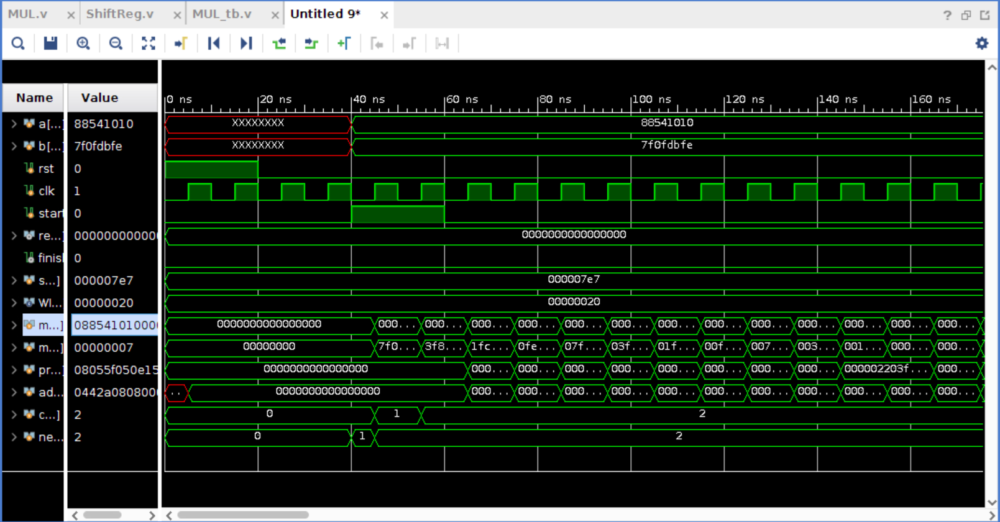</img>
</div>
<div align=center>
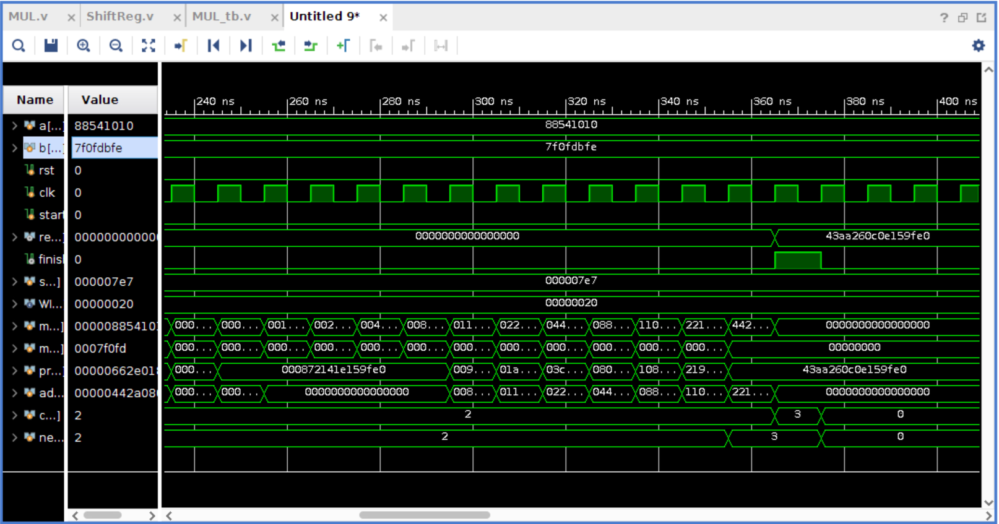</img>
</div>
<div align=center>
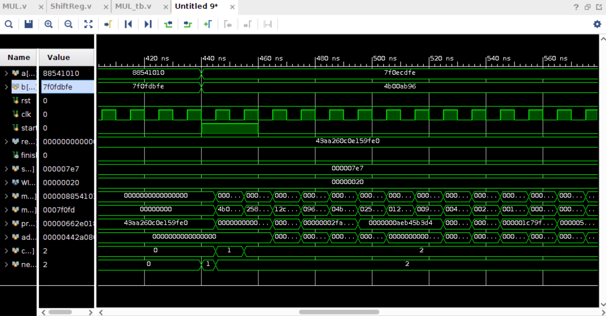</img>
</div>
<div align=center>
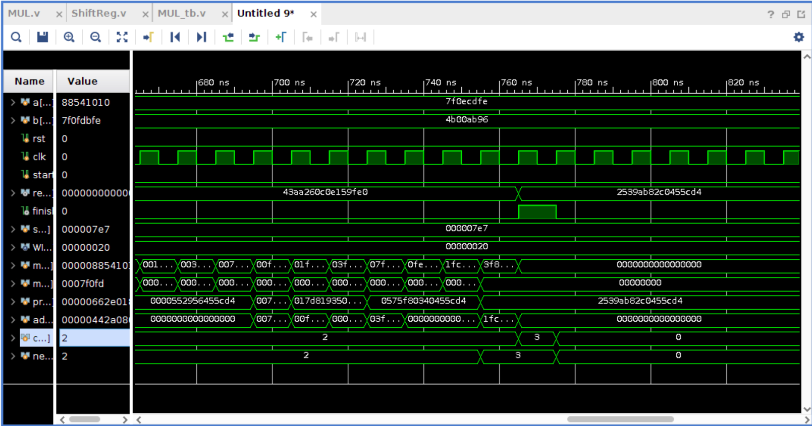</img>
</div>

### 2.2 题目 2：乘法器优化版
MUL4.v
```v
module MUL #(
    parameter                               WIDTH = 4
) (
    input                   [ 0 : 0]            clk,
    input                   [ 0 : 0]            rst,
    input                   [ 0 : 0]            start,
    input                   [ 2 : 0]            a,
    input                   [ 3 : 0]            b,
    output      reg         [ 7 : 0]            res,
    output      reg         [ 0 : 0]            finish
);
reg [2 : 0]     multiplicand;       // 被乘数寄存器
reg [7 : 0]     product;            // 乘积寄存器
reg [2 : 0]     add;

localparam IDLE = 2'b00;            // 空闲状态。这个周期寄存器保持原值不变。当 start 为 1 时跳转到 INIT。
localparam INIT = 2'b01;            // 初始化。下个周期跳转到 CALC
localparam CALC = 2'b10;            // 计算中。计算完成时跳转到 DONE
localparam DONE = 2'b11;            // 计算完成。下个周期跳转到 IDLE
reg [1:0] current_state, next_state;
reg [0:0] calc;
reg [1:0] count;
```
```v

// 请完成有限状态机以及乘法器模块的设计
// ==========================================================
// Part 1: 使用同步时序进行状态更新，即更新 current_state 的内容。
// ==========================================================

always @(posedge clk) begin
    // 首先检测复位信号
    if(rst) begin
        current_state=IDLE;
    end
    // 随后再进行内容更新
    else begin
        current_state = next_state;
    end
end

// ==========================================================
// Part 2: 使用组合逻辑判断状态跳转逻辑，即根据 current_state 与
//         其他信号确定 next_state。
// ==========================================================

always @(*) begin
    // 先对 next_state 进行默认赋值，防止出现遗漏
    next_state = current_state;

    case (current_state)
            IDLE: begin
                if(start) begin   
                    next_state = INIT;
                end
            end
            INIT: begin
                multiplicand = a;
                next_state = CALC;
                calc=0;
            end
            CALC: begin
                calc = 1;
                if(count==3) begin
                    calc = 0;
                    next_state = DONE;
                end
            end
            DONE: begin
                next_state = IDLE;
            end         
    endcase
end

always @(posedge clk) begin
    if(current_state==INIT) begin
        product = {5'b0,{b[3:0]}};
        count = 0;
    end
    if(current_state==CALC)begin
        if(product[0]==1)begin
            add = multiplicand;
        end
        else begin
            add = 0; 
        end
        product[7:4] = product[7:4] + {1'b0,{add[2:0]}};
        if(calc)begin
            product = {1'b0,{product[7:1]}};
            count = count+1;
        end
    end 
end

// ==========================================================
// Part 3: 使用组合逻辑描述状态机的输出。这里是 mealy 型状态机
//         与 moore 型状态机区别的地方。
// ==========================================================

always @(*)
    finish = (current_state == DONE);

always @(finish)begin
    res = {1'b0,{product[7:1]}};
end

endmodule
```

TOP.v
```v
module Top(
    input                   clk,
    input                   rst,
    input       [2:0]       a,
    input       [3:0]       b,
    input                   start,
    output [2:0]            seg_an,
    output [3:0]            seg_data
);

wire finish;
wire [7:0]res;

Segment segment(
    .clk(clk),
    .rst(rst),
    .output_data({24'b0,res}),
    .output_valid(8'b00000011),
    .seg_data(seg_data),
    .seg_an(seg_an)
);

MUL #(.WIDTH(4)) mul(
    .clk(clk),
    .rst(rst),
    .start(start),
    .a(a),
    .b(b),
    .finish(finish),
    .res(res)
```
```v  
);
endmodule
```

Segment.v
```v
module Segment(
    input                       clk,
    input                       rst,
    input       [31:0]          output_data,
    input       [ 7:0]          output_valid,
    output reg  [ 3:0]          seg_data,
    output reg  [ 2:0]          seg_an
);

//计数器
reg [31:0] counter;
parameter   MAX_VALUE = 32'd250_000;
always @(posedge clk) begin
    if (rst)
        counter <= 0;
    else begin
        if (counter >= MAX_VALUE)
            counter <= 0;
        else
            counter <= counter + 32'b1;
    end
end

//Update seg_id
reg [2:0] seg_id;
initial 
    seg_id<=3'b000;

always @(posedge clk) begin
    if(counter==0) begin
        if(seg_id==3'b111)
            seg_id<=3'b000;
```
```v
        else
            seg_id<=seg_id+1;
    end
    else 
        seg_id<=seg_id;
end

// Update seg_data according to seg_id. Hint: Use "case".
wire [31:0] output_data;
always @(*) begin
    seg_an = 0;    // <- Same for all cases
    seg_data = output_data[3:0];
    case(seg_id) 
        3'b000: seg_data<=output_data[3:0];
        3'b001: begin
            if(output_valid[1]) begin
                seg_data<=output_data[7:4];
                seg_an<=3'b001;
            end
        end
        3'b010: begin
            if(output_valid[2]) begin
                seg_data<=output_data[11:8];
                seg_an<=3'b010;
            end
        end
        3'b011: begin
            if(output_valid[3]) begin
                seg_data<=output_data[15:12];
                seg_an<=3'b011;
            end
        end
        3'b100: begin
            if(output_valid[4]) begin
                seg_data<=output_data[19:16];
                seg_an<=3'b100;
            end
        end
        3'b101: begin
            if(output_valid[5]) begin
                seg_data<=output_data[23:20];
                seg_an<=3'b101;
            end
        end
        3'b110: begin
            if(output_valid[6]) begin
                seg_data<=output_data[27:24];
                seg_an<=3'b110;
            end
        end
        3'b111: begin
            if(output_valid[7]) begin
                seg_data<=output_data[31:28];
                seg_an<=3'b111;
            end
        end
    endcase   
end

endmodule
```

XDC.xdc
```xdc
set_property -dict { PACKAGE_PIN A14   IOSTANDARD LVCMOS33 } [get_ports { seg_data[0] }];
set_property -dict { PACKAGE_PIN A13   IOSTANDARD LVCMOS33 } [get_ports { seg_data[1] }];
set_property -dict { PACKAGE_PIN A16   IOSTANDARD LVCMOS33 } [get_ports { seg_data[2] }];
set_property -dict { PACKAGE_PIN A15   IOSTANDARD LVCMOS33 } [get_ports { seg_data[3] }];
set_property -dict { PACKAGE_PIN B17   IOSTANDARD LVCMOS33 } [get_ports { seg_an[0] }];
set_property -dict { PACKAGE_PIN B16   IOSTANDARD LVCMOS33 } [get_ports { seg_an[1] }];
set_property -dict { PACKAGE_PIN A18   IOSTANDARD LVCMOS33 } [get_ports { seg_an[2] }];

## FPGAOL BUTTON & SOFT_CLOCK

# set_property -dict { PACKAGE_PIN B18   IOSTANDARD LVCMOS33 } [get_ports { btn }];
```
```xdc
##USB-RS232 Interface

#set_property -dict { PACKAGE_PIN C4    IOSTANDARD LVCMOS33 } [get_ports { UART_TXD_IN }]; #IO_L7P_T1_AD6P_35 Sch=uart_txd_in
#set_property -dict { PACKAGE_PIN D4    IOSTANDARD LVCMOS33 } [get_ports { UART_RXD_OUT }]; #IO_L11N_T1_SRCC_35 Sch=uart_rxd_out
#set_property -dict { PACKAGE_PIN D3    IOSTANDARD LVCMOS33 } [get_ports { UART_CTS }]; #IO_L12N_T1_MRCC_35 Sch=uart_cts
#set_property -dict { PACKAGE_PIN E5    IOSTANDARD LVCMOS33 } [get_ports { UART_RTS }]; #IO_L5N_T0_AD13N_35 Sch=uart_rts

## DIY

## Clock signal
set_property -dict { PACKAGE_PIN E3    IOSTANDARD LVCMOS33 } [get_ports { clk }]; #IO_L12P_T1_MRCC_35 Sch=clk100mhz

## FPGAOL SWITCH

set_property -dict { PACKAGE_PIN D14   IOSTANDARD LVCMOS33 } [get_ports { b[0] }];
set_property -dict { PACKAGE_PIN F16   IOSTANDARD LVCMOS33 } [get_ports { b[1] }];
set_property -dict { PACKAGE_PIN G16   IOSTANDARD LVCMOS33 } [get_ports { b[2] }];
set_property -dict { PACKAGE_PIN H14   IOSTANDARD LVCMOS33 } [get_ports { b[3] }];
set_property -dict { PACKAGE_PIN E16   IOSTANDARD LVCMOS33 } [get_ports { a[0] }];
set_property -dict { PACKAGE_PIN F13   IOSTANDARD LVCMOS33 } [get_ports { a[1] }];
set_property -dict { PACKAGE_PIN G13   IOSTANDARD LVCMOS33 } [get_ports { a[2] }];
set_property -dict { PACKAGE_PIN H16   IOSTANDARD LVCMOS33 } [get_ports { rst }];

## FPGAOL BUTTON & SOFT_CLOCK

set_property -dict { PACKAGE_PIN B18   IOSTANDARD LVCMOS33 } [get_ports { start }];
```

#### 2.2.2 仿真结果分析
（仿真为32位的优化乘法器）
<div align=center>
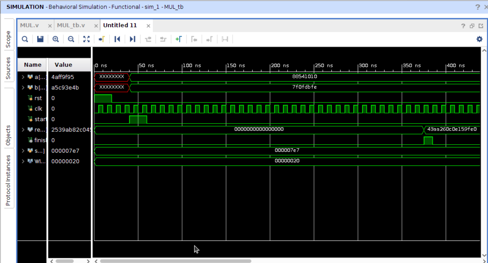</img>
</div>
<div align=center>
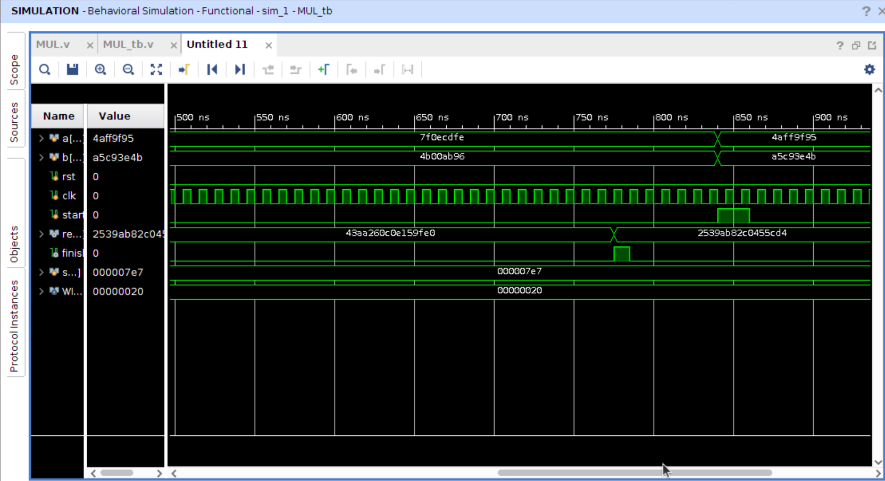</img>
</div>


#### 2.2.3 测试结果与分析
<div align=center>
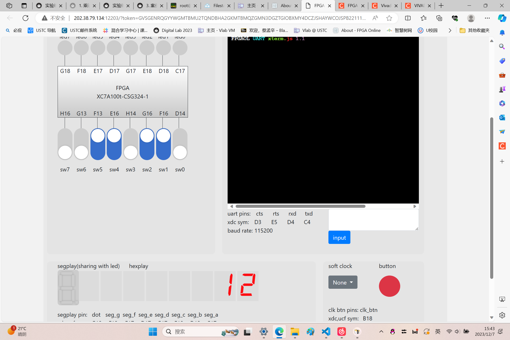</img>
</div>
<div align=center>
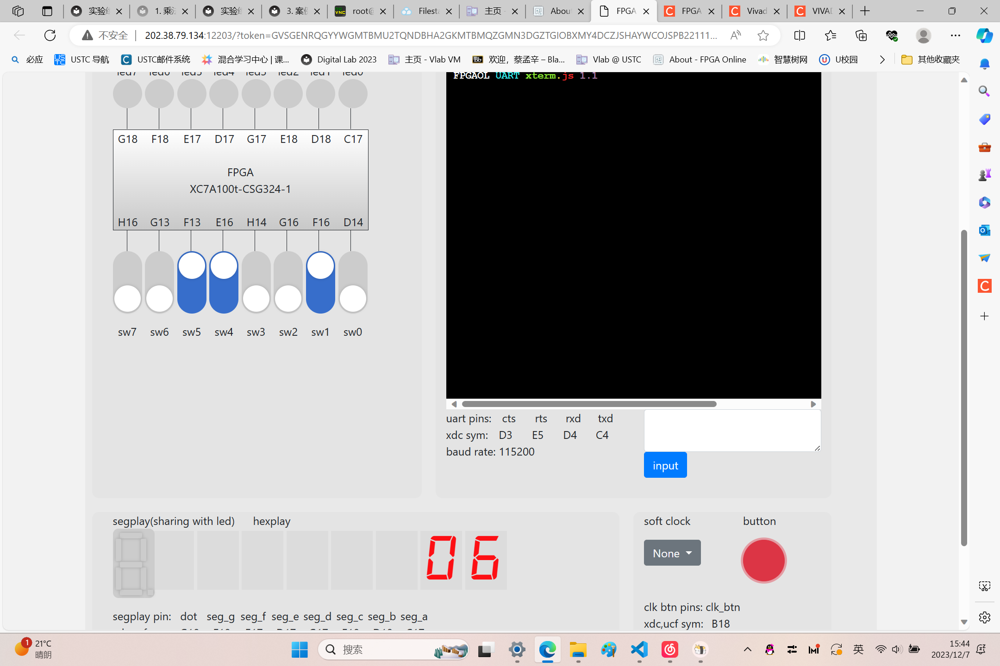</img>
</div>

### 2.3 题目 3：性能比较
#### 2.3.1 逻辑设计
test_mult.v
```v
module test_mult (
    input                   [ 0 : 0]        clk,
    input                   [ 3 : 0]        a,
    input                   [ 3 : 0]        b,
    output      reg         [ 7 : 0]        out
);

reg [3:0]      a_reg;
reg [3:0]      b_reg;
reg [0:0]      rst;
wire [7:0]     out_wire;
wire [0:0]     finish;

always @(posedge clk) begin
    a_reg <= a;
    b_reg <= b;
    out <= out_wire;
end

// 下面例化一个组合逻辑乘法器，MUL 模块的具体实现此处省略。
MUL_ver mul(
    .clk(clk),
    .rst(rst),
    .start(start),
    .a(a_reg),
    .b(b_reg),
    .res(out_wire),
    .finish(finish)
);
endmodule
```

xdc
```xdc
## This file is a general .xdc for FPGAOL_BOARD (adopted from Nexys4 DDR Rev. C)
## To use it in a project:
## - uncomment the lines corresponding to used pins
## - rename the used ports (in each line, after get_ports) according to the top level signal names in the project

## Clock signal
set_property -dict { PACKAGE_PIN E3    IOSTANDARD LVCMOS33 } [get_ports { clk }]; #IO_L12P_T1_MRCC_35 Sch=clk100mhz
create_clock -add -name sys_clk_pin -period 10.00 -waveform {0 5} [get_ports {clk}]; ##更改此处

## ...
```

#### 2.3.2 测试结果与分析
个人：
<div align=center>
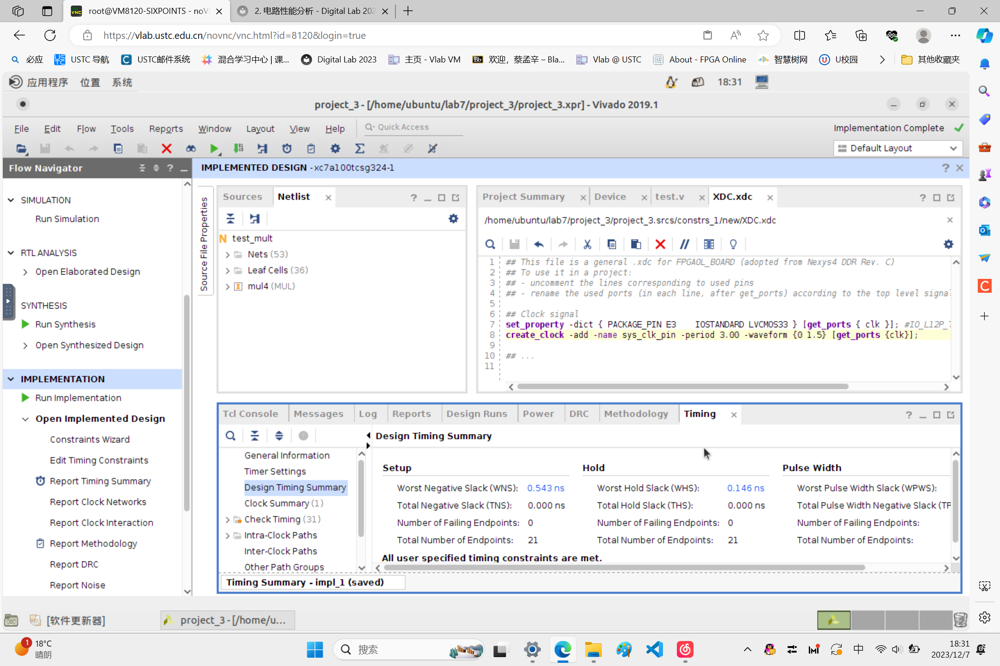</img>
</div>

使用 Verilog 乘法运算符的乘法器：
<div align=center>
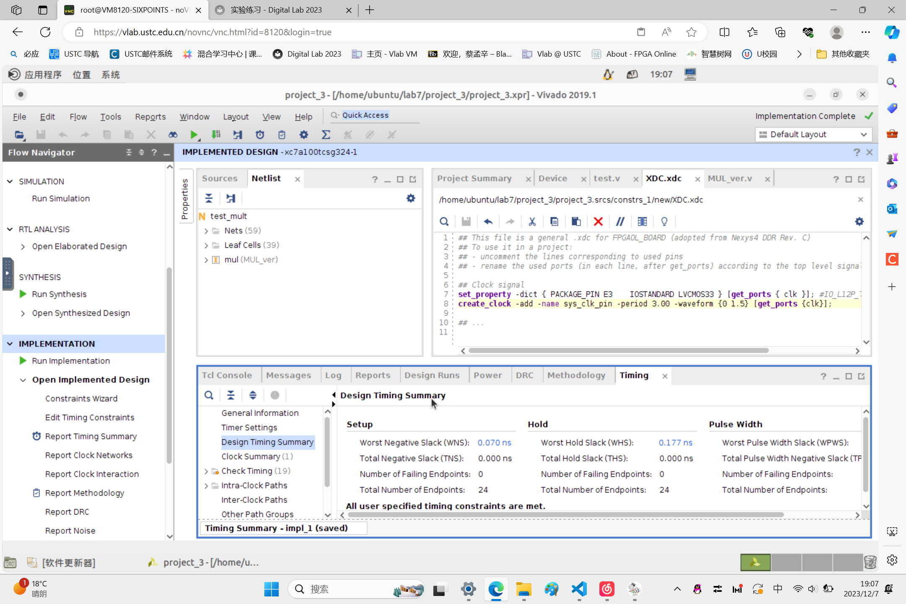</img>
</div>

### 2.4 题目 4：有符号乘法
#### 2.4.1 逻辑设计
```v
module MUL #(
    parameter                               WIDTH = 32
) (
    input                   [ 0 : 0]            clk,
    input                   [ 0 : 0]            rst,
    input                   [ 0 : 0]            start,
    input                   [ 31 : 0]            a,
    input                   [ 31 : 0]            b,
    output      reg         [ 63 : 0]            res,
    output      reg         [ 0 : 0]            finish
);
reg [30 : 0]     multiplicand;       // 被乘数寄存器
reg [62 : 0]     product;            // 乘积寄存器
reg [30 : 0]     add;

localparam IDLE = 2'b00;            // 空闲状态。这个周期寄存器保持原值不变。当 start 为 1 时跳转到 INIT。
localparam INIT = 2'b01;            // 初始化。下个周期跳转到 CALC
localparam CALC = 2'b10;            // 计算中。计算完成时跳转到 DONE
localparam DONE = 2'b11;            // 计算完成。下个周期跳转到 IDLE
reg [1:0] current_state, next_state;

reg [0:0] calc;
reg [4:0] count;
reg [0:0] flag;

// 请完成有限状态机以及乘法器模块的设计
// ==========================================================
// Part 1: 使用同步时序进行状态更新，即更新 current_state 的内容。
// ==========================================================

always @(posedge clk) begin
    // 首先检测复位信号
    if(rst) begin
        current_state=IDLE;
    end
```
```v
    // 随后再进行内容更新
    else begin
        current_state = next_state;
    end
end

// ==========================================================
// Part 2: 使用组合逻辑判断状态跳转逻辑，即根据 current_state 与
//         其他信号确定 next_state。
// ==========================================================

always @(*) begin
    // 先对 next_state 进行默认赋值，防止出现遗漏
    next_state = current_state;

    case (current_state)
            IDLE: begin
                if(start) begin   
                    next_state = INIT;
                end
            end
            INIT: begin
                next_state = CALC;
                calc=0;
            end
            CALC: begin
                calc = 1;
                if(count==5'b11110) begin
                    calc = 0;
                    next_state = DONE;
                end
            end
            DONE: begin
                next_state = IDLE;
            end         
    endcase
end

always @(posedge clk) begin
    if(current_state==INIT) begin
        multiplicand = a[30:0];
        product = {32'b0,{b[30:0]}};
        count = 0;
        flag = a[31]^b[31];
    end
    if(current_state==CALC)begin
        if(product[0]==1)begin
            add = multiplicand;
        end
        else begin
            add = 0; 
        end
        product[62:31] = product[62:31] + {1'b0,{add[30:0]}};
        if(calc)begin
            product = {1'b0,{product[62:1]}};
            count = count+1;
        end
    end 
end

// ==========================================================
// Part 3: 使用组合逻辑描述状态机的输出。这里是 mealy 型状态机
//         与 moore 型状态机区别的地方。
// ==========================================================

always @(*)
    finish = (current_state == DONE);

always @(finish)begin
    res = {{flag[0]},1'b0,{product[62:1]}};
end

endmodule
```

#### 2.4.2 仿真结果与分析
<div align=center>
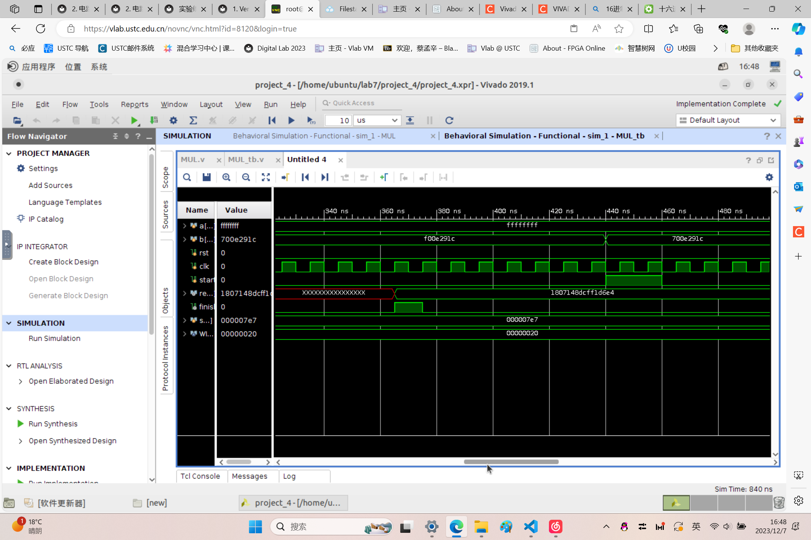</img>
</div>
<div align=center>
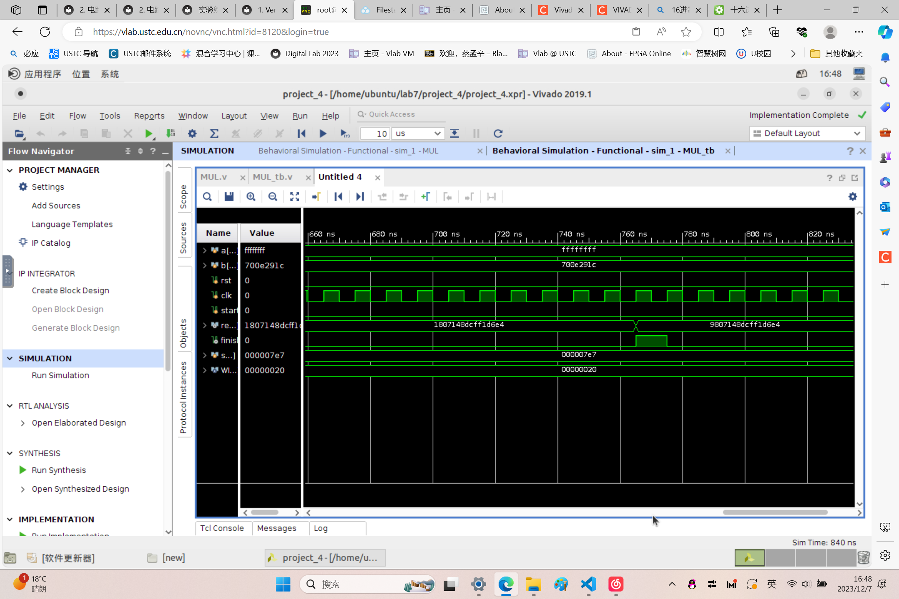</img>
</div>


### 2.5 （选做）Logisim 搭建乘法器
<div align=center>
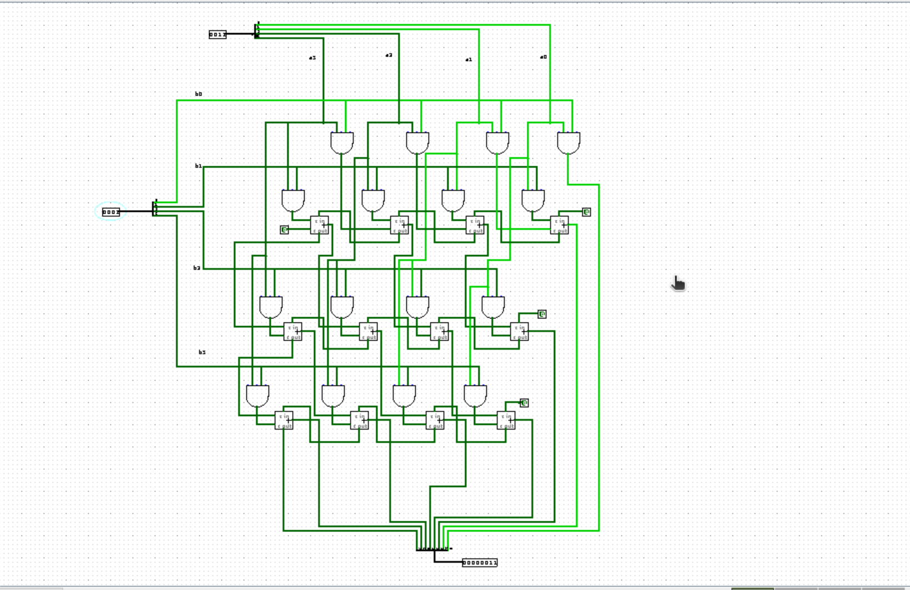</img>
</div>


## 总结

> 感谢助教 