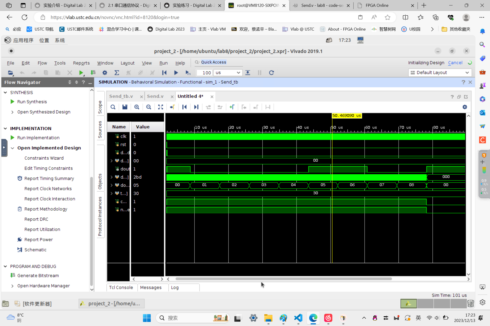
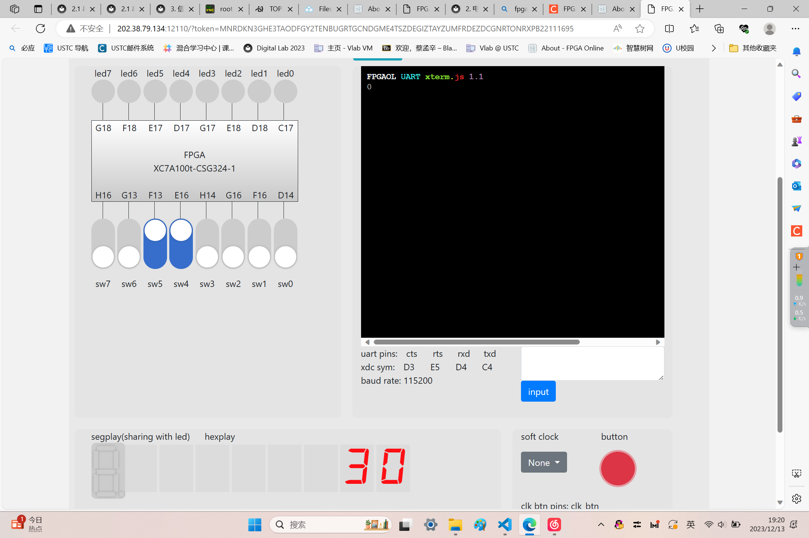
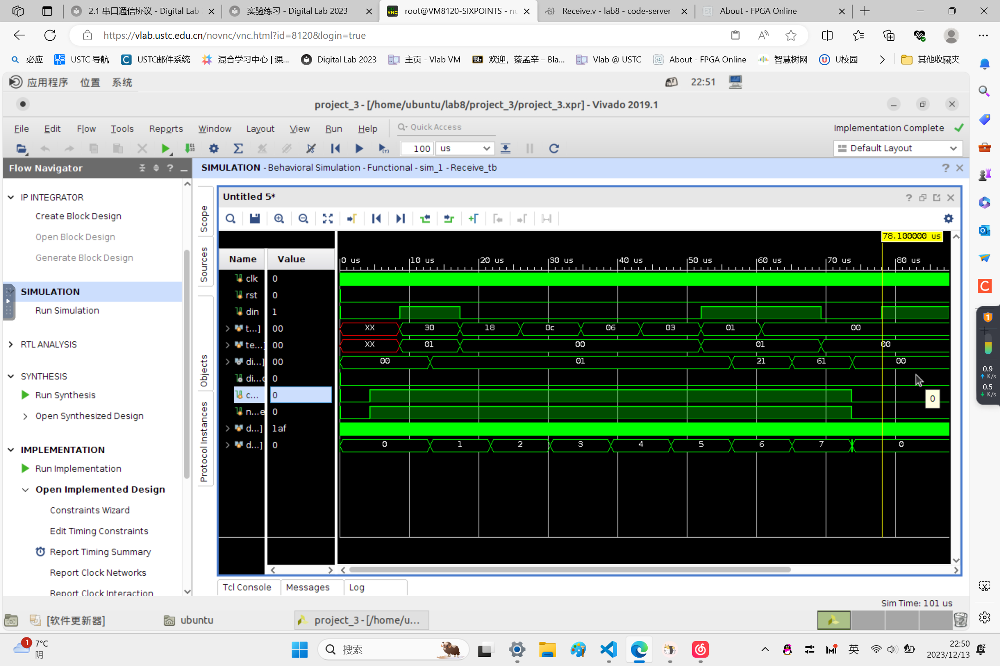
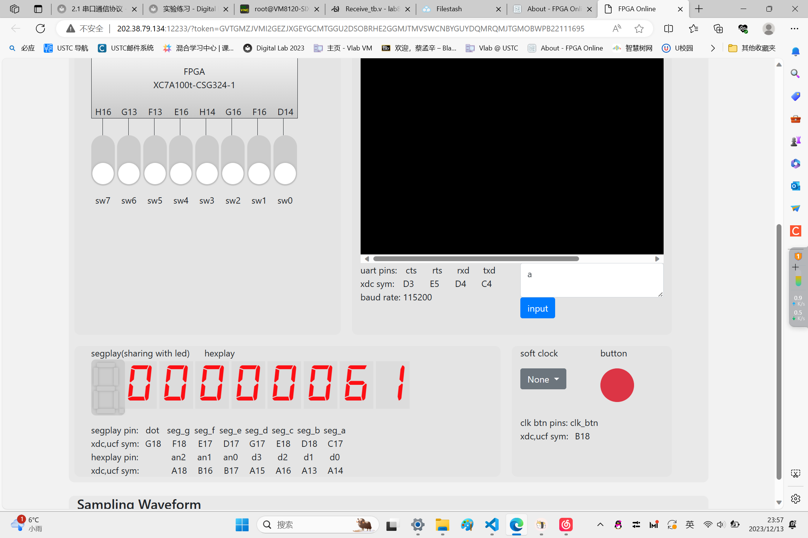
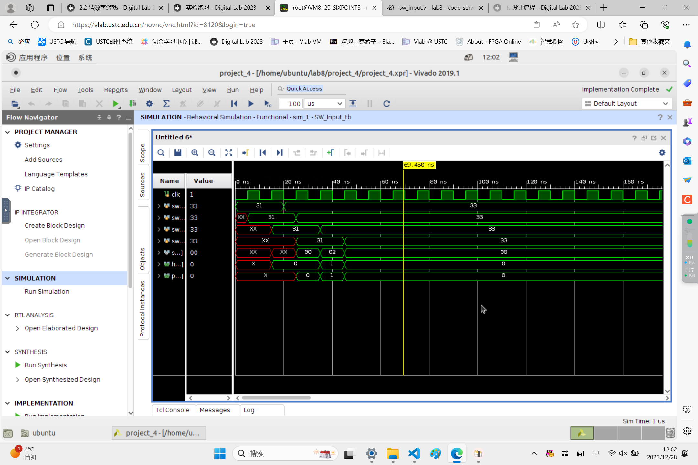
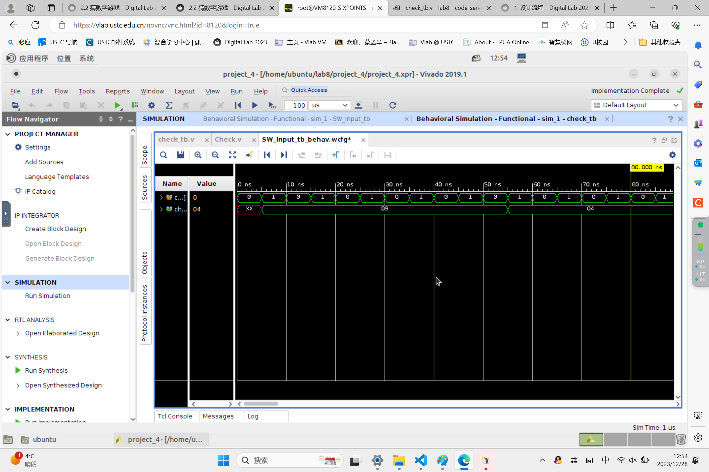

# Lab 8 report

**PB2111695 蔡孟辛**


## 1 实验目的与内容

> 1. 熟练掌握前面实验中的所有知识点；
> 2. 熟悉几种常用通信接口的工作原理及使用；
> 3. 独立完成具有一定规模的功能电路设计。

## 2 PART 1 方向二
### 题目 2-1：串口回显
略
### 题目 2-2：串口发送模块
Send.v
```v
module Send(
    input                   [ 0 : 0]        clk, 
    input                   [ 0 : 0]        rst,

    output      reg         [ 0 : 0]        dout,

    input                   [ 0 : 0]        dout_vld,
    input                   [ 7 : 0]        dout_data
);

// Counter and parameters
localparam FullT        = 867;
localparam TOTAL_BITS   = 9;
reg [ 9 : 0] div_cnt;           // 分频计数器，范围 0 ~ 867
reg [ 4 : 0] dout_cnt;          // 位计数器，范围 0 ~ 9
```
```v
// Main FSM
localparam WAIT     = 0;
localparam SEND     = 1;
reg current_state, next_state;
always @(posedge clk) begin
    if (rst)
        current_state <= WAIT;
    else
        current_state <= next_state;
end

always @(*) begin
    next_state = current_state;
    case (current_state)
        WAIT: begin
            if(dout_vld)
                next_state = SEND;
        end
        SEND: begin
            if(dout_cnt == TOTAL_BITS)
                next_state = WAIT;
        end
    endcase
end

// Counter
always @(posedge clk) begin
    if (rst)
        div_cnt <= 10'H0;
    else 
        if (current_state == SEND) begin
            if(div_cnt < FullT) begin
                div_cnt <= div_cnt + 1;
            end
            else
                div_cnt <= 10'H0;
        end
        else
            div_cnt <= 10'H0;
end

always @(posedge clk) begin
    if (rst)
        dout_cnt <= 4'H0;
    else 
        if (current_state == SEND) begin
            if(div_cnt == FullT) begin
                if(dout_cnt < TOTAL_BITS)
                    dout_cnt <= dout_cnt + 1;
                else
                    dout_cnt <= 4'H0;
            end
        end
        else
            dout_cnt <= 4'H0;
end

reg [7 : 0] temp_data;      // 用于保留待发送数据，这样就不怕 dout_data 的变化了
always @(posedge clk) begin
    if (rst)
        temp_data <= 8'H0;
    else if (current_state == WAIT && dout_vld)
        temp_data <= dout_data;
end

always @(posedge clk) begin
    if (rst)
        dout <= 1'B1;
    else begin
        //todo
        if(current_state == SEND)
            case(dout_cnt)
                4'd0:   dout <= 1'b0;
                4'd1:   dout <= temp_data[0];
                4'd2:   dout <= temp_data[1];
                4'd3:   dout <= temp_data[2];
                4'd4:   dout <= temp_data[3];
                4'd5:   dout <= temp_data[4];
                4'd6:   dout <= temp_data[5];
                4'd7:   dout <= temp_data[6];
                4'd8:   dout <= temp_data[7];
                4'd9:   dout <= 1'b1;
            endcase
        else
            dout <= 1'B1;
    end
end
endmodule

```

#### 仿真结果
<div align=center>
</img>
</div>

#### 上板结果
<div align=center>
</img>
</div>


### 题目 2-3：串口接收模块
Receive.v
```v
module Receive(
    input                   [ 0 : 0]        clk,
    input                   [ 0 : 0]        rst,

    input                   [ 0 : 0]        din,

    output      reg         [ 0 : 0]        din_vld,
    output      reg         [ 7 : 0]        din_data
);
```
```v
// Counter and parameters
localparam FullT        = 867;
localparam HalfT        = 433;
localparam TOTAL_BITS   = 8;
reg [ 9 : 0] div_cnt;       // 分频计数器，范围 0 ~ 867
reg [ 3 : 0] din_cnt;       // 位计数器，范围 0 ~ 8

// Main FSM
localparam WAIT     = 0;
localparam RECEIVE  = 1;
reg current_state, next_state;
always @(posedge clk) begin
    if (rst)
        current_state <= WAIT;
    else
        current_state <= next_state;
end

always @(*) begin
    next_state = current_state;
    case (current_state)
        // TODO
        WAIT: begin
            if(div_cnt == HalfT)
                next_state = RECEIVE;
        end
        RECEIVE: begin
            if(din_cnt == TOTAL_BITS && div_cnt == FullT)
                next_state = WAIT; 
        end
    endcase
end

// Counter
always @(posedge clk) begin
    if (rst)
        div_cnt <= 10'H0;
    else begin
        if (current_state == WAIT) begin // STATE WAIT
            // TODO
            if(din == 0) begin
                if(div_cnt < HalfT)
                    div_cnt <= div_cnt + 1;
                else
                    div_cnt <= 10'H0;
            end
        end
        else begin  // STATE RECEIVE
            // TODO
            if(div_cnt < FullT)
                div_cnt <= div_cnt + 1;
            else
                div_cnt <= 10'H0;
        end
    end
end

always @(posedge clk) begin
    if (rst)
        din_cnt <= 0;
    else begin
        // TODO
        if(current_state == RECEIVE) begin
            if(div_cnt == FullT) begin
                if(din_cnt < TOTAL_BITS)
                    din_cnt <= din_cnt + 1;
                else 
                    din_cnt <= 0;
            end
        end
        else
            din_cnt <= 0;
    end
end

// Output signals
reg [ 0 : 0] accept_din;    // 位采样信号
always @(*) begin
    accept_din = 1'B0;      //初值
    // TODO
    if(current_state == RECEIVE && div_cnt == FullT)
        accept_din = 1'B1;
end

always @(*) begin
    din_vld = 1'B0;
    // TODO
    if(div_cnt == FullT && din_cnt == TOTAL_BITS)
        din_vld = 1'B1;
end

always @(posedge clk) begin
    if (rst)
        din_data <= 8'B0;
    else if (current_state == WAIT)
        din_data <= 8'B0;
    else if (accept_din)
        din_data <= din_data | (din << din_cnt);
end
endmodule
```

#### 仿真结果
<div align=center>
</img>
</div>

#### 上板结果
<div align=center>
</img>
</div>


## 3 PART 2 猜数字游戏
### 题目 2-A-1：开关输入
sw_input.v
```v
module Input(
    input                   [ 0 : 0]            clk,
    input                   [ 0 : 0]            rst,
    input                   [ 7 : 0]            sw,

    output      reg         [ 3 : 0]            hex,
    output                  [ 0 : 0]            pulse
);
// 三级寄存器边沿检测
reg [7:0] sw_reg_1, sw_reg_2, sw_reg_3;
always @(posedge clk) begin
    if (rst) begin
        sw_reg_1 <= 0;
        sw_reg_2 <= 0;
        sw_reg_3 <= 0;
    end
    else begin
        // TODO：补充边沿检测的代码
        sw_reg_1 <= sw;
        sw_reg_2 <= sw_reg_1;
        sw_reg_3 <= sw_reg_2;
    end
end

// TODO：检测上升沿
wire [7:0] sw_change = sw_reg_2 & (~sw_reg_3);
```
```v
// TODO：编写代码，产生 hex 和 pulse 信号。
// Hint：这两个信号均为组合逻辑产生。 译码器？
always @(*) begin
    case (sw_change)
        8'b1:hex = 4'd0;
        8'b10:hex = 4'd1;
        8'b100:hex = 4'd2;
        8'b1000:hex = 4'd3;
        8'b10000:hex = 4'd4;
        8'b100000:hex = 4'd5;
        8'b1000000:hex = 4'd6;
        8'b10000000:hex = 4'd7;
        default: hex = 4'b0;
    endcase
end
assign pulse = (sw_change!=0);

endmodule
```

#### 仿真结果
<div align=center>
</img>
</div>


### 题目 2-A-2：结果比对
Check.v
```v
module Check(
    input                   [ 0 : 0]            clk,
    input                   [ 0 : 0]            rst,

    input                   [11 : 0]            input_number,
    input                   [11 : 0]            target_number,
    input                   [ 0 : 0]            start_check,

    output                  [ 5 : 0]            check_result
);
// 模块内部用寄存器暂存输入信号，从而避免外部信号突变带来的影响
reg [11:0] current_input_data, current_target_data;
always @(posedge clk) begin
    if (rst) begin
        current_input_data <= 0;
        current_target_data <= 0;
    end
    else if (start_check) begin 
        current_input_data <= input_number;
        current_target_data <= target_number;
    end
end

// 使用组合逻辑产生比较结果
wire [3:0] target_number_3, target_number_2, target_number_1;
wire [3:0] input_number_3, input_number_2, input_number_1;
assign input_number_1 = current_input_data[3:0];
assign input_number_2 = current_input_data[7:4];
assign input_number_3 = current_input_data[11:8];
assign target_number_1 = current_target_data[3:0];
assign target_number_2 = current_target_data[7:4];
assign target_number_3 = current_target_data[11:8];

reg i1t1, i1t2, i1t3, i2t1, i2t2, i2t3, i3t1, i3t2, i3t3;
always @(*) begin
```
```v
    i1t1 = (input_number_1 == target_number_1);
    i1t2 = (input_number_1 == target_number_2);
    i1t3 = (input_number_1 == target_number_3);
    i2t1 = (input_number_2 == target_number_1);
    i2t2 = (input_number_2 == target_number_2);
    i2t3 = (input_number_2 == target_number_3);
    i3t1 = (input_number_3 == target_number_1);
    i3t2 = (input_number_3 == target_number_2);
    i3t3 = (input_number_3 == target_number_3);
end

// TODO：按照游戏规则，补充 check_result 信号的产生逻辑
assign check_result[5] = i1t1 & i2t2 & i3t3;
assign check_result[4] = (i1t1 & i2t2 & ~i3t3)|(~i1t1 & i2t2 & i3t3)|(i1t1 & ~i2t2 & i3t3);
assign check_result[3] = (i1t1 & ~i2t2 & ~i3t3)|(~i1t1 & i2t2 & ~i3t3)|(~i1t1 & ~i2t2 & i3t3);

assign check_result[2] = (i1t2 | i1t3) & (i2t1 | i2t3) & (i3t1 | i3t2);
assign check_result[1] = ((i1t2 | i1t3) & (i2t1 | i2t3) & ~(i3t1 | i3t2)) | (~(i1t2 | i1t3) & (i2t1 | i2t3) & (i3t1 | i3t2)) | ((i1t2 | i1t3) & ~(i2t1 | i2t3) & (i3t1 | i3t2));
assign check_result[0] = ((i1t2 | i1t3) & ~(i2t1 | i2t3) & ~(i3t1 | i3t2)) | (~(i1t2 | i1t3) & (i2t1 | i2t3) & ~(i3t1 | i3t2)) | (~(i1t2 | i1t3) & ~(i2t1 | i2t3) & (i3t1 | i3t2));

endmodule
```

#### 仿真结果
<div align=center>
</img>
</div>

### 题目 2-A-3：计时器
Timer.v
```v
module Timer(
    input                   [ 0 : 0]            clk,
    input                   [ 0 : 0]            rst,

    input                   [ 0 : 0]            set,
    input                   [ 0 : 0]            en,

    output                  [ 7 : 0]            minute,
    output                  [ 7 : 0]            second,
    output                  [11 : 0]            micro_second,

    output                  [ 0 : 0]            finish
);

reg current_state, next_state;
localparam ON = 1;
localparam OFF = 0;

always @(posedge clk) begin
    if (rst)
        current_state <= OFF;
    else
        current_state <= next_state;
end

// TODO: Finish the FSM
always @(*) begin
    next_state = current_state;

    case (current_state)
            OFF: begin
                if(en) begin   
                    next_state = ON;
                end
            end
```
```v
            ON: begin
                if((~en||finish)==0) begin
                    next_state = OFF;
                end
            end       
    endcase
end

localparam TIME_1MS = 100_000_000 / 1000;
reg [31 : 0] counter;
// TODO: Finish the counter
always @(posedge clk) begin
    if (rst) begin
        counter <= 0;
    end
    else begin
        if(current_state==ON) begin
            if (counter >= TIME_1MS) begin
                counter <= 0;
            end
            else
                counter <= counter + 32'd1;
        end
    end
end

wire carry_in[2:0];
Clock # (
    .WIDTH                  (8)    ,
    .MIN_VALUE              (0)    ,
    .MAX_VALUE              (59)   ,
    .SET_VALUE              (1)      
) minute_clock (
    .clk                    (clk),
    .rst                    (rst),
    .set                    (set),
    .carry_in               (carry_in[2]),
    .carry_out              (finish),
    .value                  (minute)
);
Clock # (
    .WIDTH                  (8)   ,
    .MIN_VALUE              (0)   ,
    .MAX_VALUE              (59)  ,
    .SET_VALUE              (0)      
) second_clock (
    .clk                    (clk),
    .rst                    (rst),
    .set                    (set),
    .carry_in               (carry_in[1]),
    .carry_out              (carry_in[2]),
    .value                  (second)
);
Clock # (
    .WIDTH                  (12)   ,
    .MIN_VALUE              (0)    ,
    .MAX_VALUE              (999)  ,
    .SET_VALUE              (0)      
) micro_second_clock (
    .clk                    (clk),
    .rst                    (rst),
    .set                    (set),
    .carry_in               (carry_in[0]),
    .carry_out              (carry_in[1]),
    .value                  (micro_second)
);
// TODO: what's carry_in[0] ?
assign carry_in[0] = (counter==TIME_1MS);

endmodule
```

### 题目 2-A-4：控制单元
Control.v
```v
module Control (
    input                   [ 0 : 0]            clk,
    input                   [ 0 : 0]            rst,
    input                   [ 0 : 0]            btn,

    input                   [ 5 : 0]            check_result,
    output      reg         [ 0 : 0]            check_start,
    output      reg         [ 0 : 0]            timer_en,
    output      reg         [ 0 : 0]            timer_set,
    input                   [ 0 : 0]            timer_finish,

    output      reg         [ 1 : 0]            led_sel,
    output      reg         [ 1 : 0]            seg_sel,
    output      reg         [ 0 : 0]            generate_random
);

reg [1:0] current_state, next_state;
localparam WAIT = 2'd0;
localparam START = 2'd1;
localparam CHECK = 2'd2;
localparam ENDIT = 2'd3;

always @(posedge clk) begin
    if (rst)
        current_state <= WAIT;
    else
        current_state <= next_state;
end

reg btn_reg1,btn_reg2;
wire btn_change;
always @(posedge clk) begin
    if(rst)begin
        btn_reg1 <= 0;
        btn_reg2 <= 0;
    end
    else begin
        btn_reg1 <= btn;
        btn_reg2 <= btn_reg1;
    end
end
assign btn_change = (btn_reg1 & (~btn_reg2));

reg flag;
always @(*) begin
    next_state = current_state;

    case (current_state)
            WAIT: begin
                timer_set=1;
                flag=0;
                led_sel=0;//不亮
                seg_sel=0;//000
                generate_random=1;
                if(btn_change) begin   
                    next_state = START;
                end
            end
            START: begin
                generate_random=0;
                led_sel=2'd1;//流水灯
                timer_en=1;
                timer_set=0;
                seg_sel=2'b1;//倒计时
                if(timer_finish)begin
                    next_state=ENDIT;
                end
                if(btn_change) begin
                    next_state = CHECK;
                end
            end    
            CHECK: begin
                check_start=1;
                led_sel=2'd2;//显示答案
                if(check_result==6'b100000) begin
                    flag=1;
                    check_start=0;
                    next_state=ENDIT;
                end
                if(btn_change) begin
                    check_start=0;
                    next_state=START;
                end
            end
            ENDIT: begin
                timer_en=0;
                if(flag)begin
                    led_sel=2'b11;
                    seg_sel=2'd2;
                    flag=0;
                end
                else begin
                    led_sel=0;
                    seg_sel=2'd3;
                end
                if(btn_change) begin
                    next_state = WAIT;
                end
            end   
    endcase
end
endmodule
```

### 题目 2-A-5：组装
```v
module Top (
    input                   [ 0 : 0]            clk,
    input                   [ 0 : 0]            btn,
    input                   [ 7 : 0]            sw,

    output                  [ 7 : 0]            led,
    output                  [ 2 : 0]            seg_an,
    output                  [ 3 : 0]            seg_data
);
```
```v
wire rst = sw[7];
wire [3:0] hex;
wire pulse;
wire [31:0] dout;

Input swi(
    .clk(clk),
    .rst(rst),
    .sw(sw),
    .hex(hex),
    .pulse(pulse)
);

ShiftReg shift(
    .clk(clk),
    .rst(rst),
    .hex(hex),
    .pulse(pulse),
    .dout(dout)
);

wire start_check;
wire [5:0] check_result;
wire generate_random;
wire [11:0] random_data;

Random ran(
    .clk(clk),
    .rst(rst),
    .generate_random(generate_random),
    .sw_seed(dout[11:0]),
    .timer_seed(current_time[19:12]),
    .random_data(random_data)
);

Check check(
    .clk(clk),
    .rst(rst),
    .input_number(dout[11:0]),
    .target_number(random_data),
    .start_check(start_check),
    .check_result(check_result)
);

wire btnp;

edge_capture(
    .clk(clk),
    .rst(rst),
    .sig_in(btn),
    .pos_edge(btnp)
);

wire en, set, finish;
wire [7:0] minute, second;
wire [11:0] micro_second;

Timer timer(
    .clk(clk),
    .rst(rst),
    .set(set),
    .en(en),
    .minute(minute),
    .second(second),
    .micro_second(micro_second),
    .finish(finish)
);

wire [7:0] minute_out, second_out;
wire [11:0] micro_second_out;

Hex2BCD #(8) hex1(
    .bin(minute),
    .out(minute_out)
);

Hex2BCD #(8) hex2(
    .bin(second),
    .out(second_out)
);

Hex2BCD #(12) hex3(
    .bin(micro_second),
    .out(micro_second_out)
);

wire [1:0] led_sel,seg_sel;

Control control(
    .clk(clk),
    .rst(rst),
    .btn(btnp),
    .check_result(check_result),
    .check_start(start_check),
    .timer_en(en),
    .timer_set(set),
    .timer_finish(finish),
    .led_sel(led_sel),
    .seg_sel(seg_sel)
);

wire [7:0] flow_led, led_res;
wire [7:0] ledsrc3;
assign  ledsrc3={2'b0,check_result};

MUX4 #(8) mux1(
    .src0(8'b00000000),
    .src1(flow_led),
    .src2(ledsrc3),
    .src3(8'b11111111),
    .sel(led_sel),
    .res(led_res)
);

LED_Flow ledflow(
    .clk(clk),
    .btn(btn),
    .led(flow_led)
);

LED ledd(
    .ledres(led_res),
    .led(led)
);

wire [31:0] seg_res;
wire [31:0] current_time;

assign current_time={4'b0,minute_out[7:0],second_out[7:0],micro_second_out[11:0]};

MUX4 #(32) mux2(
    .src0(32'h0),
    .src1(current_time),
    .src2(32'h88888888),
    .src3(32'h44444444),
    .sel(seg_sel),
    .res(seg_res)
);

wire [7:0] output_vaild;

Seg_vaild vaild(
    .clk(clk),
    .rst(rst),
    .second(second),
    .output_vaild(output_vaild)
);

Segment segment(
    .clk(clk),
    .rst(rst),
    .output_data(seg_res),
    .output_valid(output_vaild),
    .seg_data(seg_data),
    .seg_an(seg_an)
);

endmodule
```

### 题目 2-A-6：更高级的猜数字游戏
#### 倒计时闪烁
Seg_vaild.v
```v
module Seg_vaild(
    input                   clk,
    input                   rst,
    input           [7:0]   second,
    output  reg     [7:0]   output_vaild
);
reg [31:0] count;
parameter   TIME_1HS = 50_000_000;
parameter   TIME_2HS = 25_000_000;

always @(posedge clk) begin
    if(rst)
        count <= 0;
    else 
        if(count >= TIME_1HS) begin
            count <= 0;
            if(second > 8'd3 && second < 8'd10)
                output_vaild <= ~ output_vaild;
            else
                output_vaild <= 8'b1111_1111;
        end
        else begin
            count <= count + 1;
            if(count == TIME_2HS && second >8'd0 && second < 8'd3)
                output_vaild <= ~output_vaild;
        end
end
endmodule
```

#### 随机生成题目
Random.v
```v
module Random(
    input                   [ 0 : 0]            clk,
    input                   [ 0 : 0]            rst,
    input                   [ 0 : 0]            generate_random,
    input                   [ 7 : 0]            sw_seed,
    input                   [ 7 : 0]            timer_seed,
    output                  [11 : 0]            random_data
);
reg [7:0] index; 
always @(posedge clk) begin
    if (rst)
        index <= 0;
    else
        if(generate_random)
            index <= (index + sw_seed + timer_seed) % 120;
end

assign random_data = targets[index];

reg [11:0] targets [0: 127];
always @(posedge clk) begin 
    // 这里用 initial 也可以，只要让 targets 中的数值保持不变即可。
    targets[0] <= 12'h012;
    targets[1] <= 12'h013;
    targets[2] <= 12'h014;
    targets[3] <= 12'h015;
    targets[4] <= 12'h021;
    targets[5] <= 12'h023;
    targets[6] <= 12'h024;
    targets[7] <= 12'h025;
    targets[8] <= 12'h031;
    targets[9] <= 12'h032;
    targets[10] <= 12'h034;
    targets[11] <= 12'h035;
    targets[12] <= 12'h041;
```
```v
    targets[13] <= 12'h042;
    targets[14] <= 12'h043;
    targets[15] <= 12'h045;
    targets[16] <= 12'h051;
    targets[17] <= 12'h052;
    targets[18] <= 12'h053;
    targets[19] <= 12'h054;

    targets[20] <= 12'h102;
    targets[21] <= 12'h103;
    targets[22] <= 12'h104;
    targets[23] <= 12'h105;
    targets[24] <= 12'h120;
    targets[25] <= 12'h123;
    targets[26] <= 12'h124;
    targets[27] <= 12'h125;
    targets[28] <= 12'h130;
    targets[29] <= 12'h132;
    targets[30] <= 12'h134;
    targets[31] <= 12'h135;
    targets[32] <= 12'h140;
    targets[33] <= 12'h142;
    targets[34] <= 12'h143;
    targets[35] <= 12'h145;
    targets[36] <= 12'h150;
    targets[37] <= 12'h152;
    targets[38] <= 12'h153;
    targets[39] <= 12'h154;

    targets[40] <= 12'h201;
    targets[41] <= 12'h203;
    targets[42] <= 12'h204;
    targets[43] <= 12'h205;
    targets[44] <= 12'h210;
    targets[45] <= 12'h213;
    targets[46] <= 12'h214;
    targets[47] <= 12'h215;
    targets[48] <= 12'h230;
    targets[49] <= 12'h231;
    targets[50] <= 12'h234;
    targets[51] <= 12'h235;
    targets[52] <= 12'h240;
    targets[53] <= 12'h241;
    targets[54] <= 12'h243;
    targets[55] <= 12'h245;
    targets[56] <= 12'h250;
    targets[57] <= 12'h251;
    targets[58] <= 12'h253;
    targets[59] <= 12'h254;

    targets[60] <= 12'h301;
    targets[61] <= 12'h302;
    targets[62] <= 12'h304;
    targets[63] <= 12'h305;
    targets[64] <= 12'h310;
    targets[65] <= 12'h312;
    targets[66] <= 12'h314;
    targets[67] <= 12'h315;
    targets[68] <= 12'h320;
    targets[69] <= 12'h321;
    targets[70] <= 12'h324;
    targets[71] <= 12'h325;
    targets[72] <= 12'h340;
    targets[73] <= 12'h341;
    targets[74] <= 12'h342;
    targets[75] <= 12'h345;
    targets[76] <= 12'h350;
    targets[77] <= 12'h351;
    targets[78] <= 12'h352;
    targets[79] <= 12'h354;

    targets[80] <= 12'h401;
    targets[81] <= 12'h402;
    targets[82] <= 12'h403;
    targets[83] <= 12'h405;
    targets[84] <= 12'h410;
    targets[85] <= 12'h412;
    targets[86] <= 12'h413;
    targets[87] <= 12'h415;
    targets[88] <= 12'h420;
    targets[89] <= 12'h421;
    targets[90] <= 12'h423;
    targets[91] <= 12'h425;
    targets[92] <= 12'h430;
    targets[93] <= 12'h431;
    targets[94] <= 12'h432;
    targets[95] <= 12'h435;
    targets[96] <= 12'h450;
    targets[97] <= 12'h451;
    targets[98] <= 12'h452;
    targets[99] <= 12'h453;

    targets[100] <= 12'h501;
    targets[101] <= 12'h502;
    targets[102] <= 12'h503;
    targets[103] <= 12'h504;
    targets[104] <= 12'h510;
    targets[105] <= 12'h512;
    targets[106] <= 12'h513;
    targets[107] <= 12'h514;
    targets[108] <= 12'h520;
    targets[109] <= 12'h521;
    targets[110] <= 12'h523;
    targets[111] <= 12'h524;
    targets[112] <= 12'h530;
    targets[113] <= 12'h531;
    targets[114] <= 12'h532;
    targets[115] <= 12'h534;
    targets[116] <= 12'h540;
    targets[117] <= 12'h541;
    targets[118] <= 12'h542;
    targets[119] <= 12'h543;
end
endmodule
```

#### BCD 码显示
Hex4BCD.v
```v
module Hex2BCD #(
    parameter W = 8
)(
    input   [W-1 : 0]       bin,
    output  [W-1 : 0]       out
);
reg [W+(W-4)/3 : 0]    bcd;
integer i,j;
always @(bin) begin
    for(i = 0; i <= W+(W-4)/3; i = i+1) bcd[i]=0;
    bcd[W-1:0] = bin;
    for(i = 0; i <= W-4; i = i+1)
        for(j = 0;j <= i/3; j = j+1)
            if(bcd[W-i+4*j -:4] > 4)
                bcd[W-i+4*j -:4] = bcd[W-i+4*j -:4] +4'd3;
end
assign out = bcd[W-1:0];
endmodule
```


## 总结
好难，我跟程序至少得崩溃一个